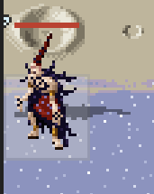
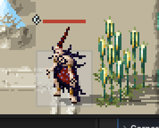
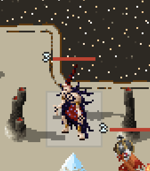
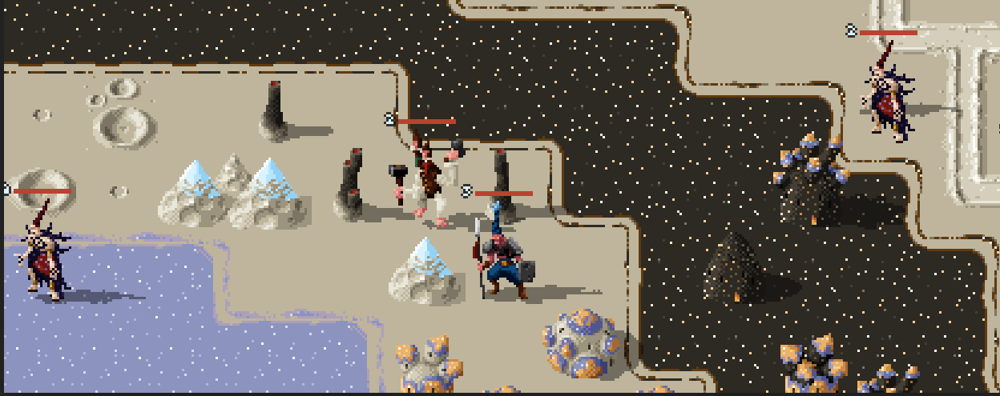

# TBT Game — Completed Work Archive

Every finished item from `todo.md`, kept verbatim for the **design record**: the
shipped-notes explain *why* a thing works the way it does, and several of them are
the only written home for a decision. Grep here before re-litigating an old call.

- **Open work lives in [todo.md](todo.md)** — this file is history only.
- Section headings mirror the original file so old references still resolve.
- Nothing here should be edited except to correct a factual error. If a shipped
  item turns out to be broken, open a NEW entry in `todo.md`; don't un-tick it here.

---

## Meeting 2026.06.28

### RQD
- [x] Main menu = scrolling your mouse between the buttons renders and unrenders the CTA because of the non-button space underneath. I'm thinking we just remove the CTA effect and use a different semantic element for the continue button.
  - **FIXED 2026-08-03 (rqd--main-menu round 9)**: rings retired from the menu venue — the
    yield rule was structurally flicker-prone (any vertical mouse path crosses inter-entry
    dead space). The default action now wears the LIT-BORDER BOX (primary-among-text-buttons,
    §14's own "pressable" mark; border steps idle→focus when aimed). Rings remain the CTA
    mark in non-menu venues (End Turn), where nothing yields. ui-style-guide §14 updated;
    pinned in test_main_menu.gd (exactly one primary, follows save state).

- [x] bEXP gripe — **SHIPPED 2026-08-03 (rqd--post-battle-flow, 6 commits, suite 717/2453)**.
	Key finding: combat XP already EXISTED (RD differential formula, flat 100/level —
	your "keep it at 100 and scale gain" position was already a code comment) but was
	INVISIBLE: no popup, no bar, silent level-ups. Shipped: (1) doctrine amendment in
	mission_objectives.md — par-band bEXP income (Above par +150 / No dawdling gimme +75,
	additive, displayed up front — the FERD sin was hiding it) + per-map objective award
	lines via new MissionCatalog (data/missions/mission_manifest.json), flat 150 retired;
	(2) chain reordered banner → RESULT SCREEN (new BattleResultPanel: turns vs par,
	itemized income, kills/losses/injuries; placeholder text log deleted) → level-ups →
	bEXP spend → conclude; (3) bEXP spend rework: whole levels bought at a PRICE TAG
	(100 × level ÷ squad max, clean-rounded, floor 25 — catch-up reads as "LV UP 25" vs
	"LV UP 90", formula invisible per your "simpler is better" call); (4) support casts
	pay flat 10/cast (effect-gated by targeting), SURVIVAL XP pays first-engagement-per-
	enemy (5 + level diff, clamp 1..15, dodge or tank — repeats teach nothing, so
	stalling pays ~1 XP once then never); (5) visibility: batched gold "+N XP" callout
	per combat, LEVEL UP! beat, XP row in the detail panel's class line; (6) the
	level-up dings finally ring (generated chime, semitone staircase per +1).
	All numbers are named dials. PLAYTEST: full 2-mission loop, then tune par values.
	It looked like bEXP was the only way units gain XP. Original notes (kept for the design record):
	This system will mostly carry over from Fire Emblem, but with some changes:
	+ The main change is that units which didn't do damage should still earn a meaningful amount of XP. That said, I *do not* want to incentivize players putting them in harm's way with a healer for several turns, so we need to design around that.
		- FERD (and possibly earlier entries I'm less familiar with) designed around this by offering more bEXP the quicker the player finishes levels. They also failed to tell the player this and I had to learn it from the wiki.
	+ I'm waffling on how to handle asymptotic decay of XP earned by overeleveled units. The gut instinct was to derive XP earned from the enemies' stats or something like that, and have higher levels require more XP to level up. This does have some drawbacks though, as that system doesn't *really* disincentivize relying exclusively on powerful units.
		- We need to bridge that gap of incentivizing fast play, taking calculated risks, while also giving weaker units something to do.
	+ bEXP should not simply be shelled out per-unit - it goes into a pool, where the player can allocate it as he sees fit. This is actually an argument *against* higher EXP reqs for higher leveled units - keep it at 100/unit and scale EXP gain differently
	+ I'd like to also incentivize not permanently benching any units. Maybe a separate system for dramatically underleveled units? We can definitely design maps in such a way that play to a variety of strengths, but this does not correct for underleveling.

- [x] Shadows occasionally bugged (see bottom left)
  
   // This one isn't bugged. But blood mage doesn't seem to enjoy being in the bottom left corner for some reason
   // Bugged again! Not in the bottom left corner, but in the bottom left quadrant. I wonder why this unit specifically has bugged shadows.
   // two blood mages in this screenshot - the one in the bottom left is *not* bugged, but the one in the center of the map *is*.
  - Delete these images once we've solved the problem
  - **FIXED 2026-08-03, pending eyeball verify** — not intermittent, and not position-related:
    the "two blood mages" are TWO DIFFERENT CHARACTERS wearing pixel-identical art. **Occult**
    (occult/idle.png + pivot sidecar → feet_drop 14) always cast correctly from the boots;
    **Blood Mage** (spaceman atlas frame 8, no sidecar) always cast from the WAIST — the atlas
    branch of `_load_character_sprite` never set `_art_feet_drop`, so the smear floated at
    mid-body (glaring over flat water/starfield, camouflaged on busy sand). Fix: the Aseprite
    trim rect IS the art bounds — feet line = `trim_offset.y + frame_height/2` (frame 8 → 12px),
    fixing every atlas-path character (spaceman roster included). Bonus: SpriteAtlasLoader now
    caches AtlasTextures per frame, so UnitShadow's RID-keyed projection cache stops re-
    rasterizing (and growing) after every attack-clip restore. Pinned in test_unit_shadow.gd
    (atlas spawn chain + shared-instance cache). Delete the four images once verified in-game.
- [x] Save/Load causes expended (for the turn) units to appear not-grayed-out
  - **FIXED 2026-08-03**: `SaveManager.apply_unit_state` restored the `can_act` latch but not
    the visual — `set_acted()` is what paints the gray, and `resume_battle` deliberately skips
    the upkeep that would repaint it. The restore now applies the acted/active modulate to
    match the latch. Pinned in test_battle_save.gd (both directions: gray comes back, and a
    ready unit restores to full color).
- [x] Grav hook pulling an enemy unit into range should allow that unit to counterattack if pulled into range of its equipped attack
  - **FIXED 2026-08-03**: counters were gated by a planning-time `can_counter_attack` (range
    baked in before hit 1) — the mid-combat range re-checks could only DENY. Split into
    ELIGIBILITY (alive, usable damaging move — locked up front) + live per-hit range, so a
    pull grants the counter exactly like a shove denies it. Combat preview predicts the
    granted counter too (`counter_granted_by_displacement`, mirror of the survives query), so
    Grav Hook's forecast shows the retaliation instead of promising a free hit. The
    OUT OF RANGE callout stays reserved for counters actually taken away — a melee defender
    plinked from range 3 is silent, same as always. Tests in test_displacement_system.gd
    (execution: pull-grants + never-in-range silence) and test_displacement_preview.gd
    (pure grant query ×4).
- [x] Bug with chain lightning effect - this is somewhat unique from other afflictions in that its stacks don't persist - they should all execute immediately in sequence, depending on how many enemy units are in range.
  - Chain Lightning 1 -> target receives 100% damage, arcs to second target, receives 50% damage
  - Chain Lightning 2 -> target receives 100% damage, arcs to second target, receives 50% damage, arcs to third target, received 25% damage. Can't hit the same target twice.
  - Chain Lightning 3 -> you can guess this
  - Chain Lightning 4 (max) -> target receives 100% damage, arcs to second target, receives 50% damage, arcs to third target, received 25% damage, arcs to 4th target, receives 12.5% damage, arcs to 5th target, receives 6.25% damage. Can't hit the same target twice.
  - damage rounds down to a minimum of 1
  - if at any point there are no more targets in range, the effect ends.
  - electric types are immune
  - we probably want an algorithm which selects next target in such a way that the effect can't jump to targets which prematurely end the effect, e.g. if there are 5+ units clustered together, we want the effect to hit at least 5 targets - if it jumps in such a way that no more targets are in range of the effect, yet we haven't expended all the stacks, we want to avoid that.
    - writing this out has made me think "maybe we want to program it differently"
      - ALTERNATIVE IDEA: ArcLightning hits orthogonal units for 50%, Diagonals for 25%, rounded down, then repeats (but can't hit the same target twice)
  - **SHIPPED 2026-08-03 — idea 1, exactly as specced** (rqd--phase4-conditional-effects, suite 673/2218):
    the "hard part" wasn't — chains are ≤4 arcs through ≤8 neighbors per hop, so
    [ScheduledEffects._best_chain](../scripts/combat/scheduled_effects.gd) does an EXHAUSTIVE
    longest-path search: the bolt never strands itself in a dead end while targets remain
    reachable (regression-pinned: a dead-end unit that sorts first in candidate order is passed
    over for the longer thread). Stacks = arc count (marker max 4 → 5-target chain), damage
    `power >> hop` floored min 1 (6 → 3 → 1 → 1 → 1), no unit struck twice per chain, ELECTRIC
    (either effective type slot) immune to every hop AND can't be marked at all, brave-immunity
    rides every arc for Shriek. Emergent rule kept: **double Shriek restacks the mark → one
    DEEPER chain, never two strikes** (the second entry finds no marker and fizzles). Arc beat
    0.15s/hop so the bolt visibly travels. DIALS (playtest): **arc reach = Chebyshev 1**
    ("touching, even at corners" — from your ArcLightning intuition; spread a full king-move
    apart to break the chain), arcs faction-blind, Shriek marks at 2 stacks. Tied longest
    chains: ALL are gathered and the **seeded GameRng picks one** (RQD follow-up same day:
    unpredictable path in play, identical bolt on a seeded reload; forced outcomes draw no
    roll, keeping the dice stream lean). Idea 2 shelved unneeded.

- [x] move chip visual design
	- [x] definitely want to keep "basic" move target schemes because it's useful to new players
	- [x] add tooltips with move details (basically the same as expanding the detail panel, perhaps with explanations) - major design decision made re: tooltips, see below — SHIPPED (hold-to-peek MoveTooltip)
	- [x] definitely need range, but let's keep it separated from the usages because having them side-by-side is confusing
	- [x] try moving the damage type icon next to the elemental type on the left? if it's ugly we'll move it back

> Let's pause and think of what's needed for targeting
Target type: enemy | point | self | unit (did I miss anything?) - represent this with Color
AoE shape: I like how you represented falloff in your mockup. We probably need the epicenter to be visually distinct
Who's damaged (for lack of a better term) - does this hit all units in its AoE, or just enemies/friendlies/other/some combination?

- [x] Implement move chips
- [x] add to options menu: auto-end turn (when no actions remaining) — SHIPPED 2026-07-29: Settings.auto_end_turn (default ON = old behavior), Options toggle, and OFF finally wires the End Turn CTA (TurnManager emits player_phase_spent; system menu's End Turn wears the rings)
- [x] having an option default selected should probably only happen when we're controlling with a controller... If there's an elegant solution lmk — SHIPPED 2026-07-29: InputSource autoload tracks which interaction MODEL drove last (presses flip it; mouse jitter/stick drift debounced out; consumers sample at boundaries = no flicker possible). Menus focus-on-open only when cursor-driven; pointer opens quiet, first nav press summons the cursor. Both inputs always live, no mode. Testable with keyboard arrows (cursor-model) — no controller needed.
- [x] Core design: Long press (touchscreen) = right click = (Back Button or R3) on controller - playtest = tooltip — SHIPPED (hold-to-peek MoveTooltip, ui-style-guide §14)
	- [x] customize the length of the long press, default 200ms (add this to the options menu) — SHIPPED (Settings.tooltip_hold_ms + Options slider 200–1000ms)

#### Dynamic unit shadow sprite system — SHIPPED (RQD-approved 2026-08-01)
  - [x] UnitShadow (scripts/units/unit_shadow.gd — its header is the living doc): live frame mirrored + CPU-rasterized on the world pixel grid; full silhouette turned 90° on the TRUE feet (art_bounds.bottom → feet_drop; the whole cast is body-centered — do NOT re-expand canvases, the game's stance depends on mid-body anchors); stance-sized blob disc welds wide stances (feet-band percentile from idle, once per character); flat 40% ink (GameColors.CAST_SHADOW_INK); z slot TERRAIN_EFFECTS−UNITS; kill switch DebugConfig.unit_cast_shadows. Dials locked by RQD eyeball: SMOOSH_X 1.0, SMOOSH_Y 0.25, SHEAR 0, OFFSET_Y −2, blob on ×1.0.
  - [~] Lawrence pass (has the override knob: character JSON sprite.shadowBlobRadius, 0 = casts no blob; global taste = SHADOW_* consts). Double/triple-darkening between units pre-approved.
  - [ ] Per-clip authored override: exporter already emits <tag>_shadow.png strips; play verbatim when one exists. Deferred until Lawrence authors the first one.
  - [ ] Grunt pivot non-compliance — Lawrence redesigning the sprite (RQD 2026-07-31 meeting item).

#### Parked items from quickfix list
- [x] grid live-paint on chip focus — SHIPPED 2026-07-30: a chip holding attention in the action menu (focus under cursor model, hover under pointer — the backlight's own channels) paints its reach footprint on the grid. Truth = MoveTargeting.get_reach_tiles (can_target's exact geometry incl. Extendo reach gating); view = GridManager.display_move_range_preview on its own decal layer (ThreatOverlayRenderer MOVE_PREVIEW style, azure placeholder for Lawrence). Depleted/locked chips paint too (fact, not affordance). Composes OVER the green movement tint. RECOLORED 2026-07-30 per RQD: paint carries the move's INTENT — red damaging / green healing / blue neither (heals wins over base_power). Bundled fixes same day: menu cursor brackets now render on disabled items (the invisible-cursor-on-depleted-chip bug), projection-static trial on all grid decals. In-game eyeball pending: intent colors over the green movement tint, static intensity, + whether the preview readout's chips deserve the same on hover (different venue, enemy context — SHOW RANGE pin already covers enemy reach).
- [x] auto-end-turn options toggle (from the meeting list above) — SHIPPED 2026-07-29; End Turn's CTA is wired to the spent-phase state (only reachable with auto-end off).
- [x] pulse-glow/rotating-glow border:
  + OK all good points so let's work through this. Maybe I need to spend some time with Lawrence mocking the thing up.
  + Collision1: Keep in mind that the GlowLabel has to do with text, not the button/stylebox, so I think we're ok there.
  + Collision2: This matters; not sure what to do about it. I'm somewhat inclined to have Lawrence pick a *selected text* color/glow but I still do like the rotating shimmer being reserved for a selected element. So it can't be both that and a call to action. Other games can have a triple-converging border that animates from a few pixels out (dimmer at the edges) that looks like it's shrinking inward toward the center (for a call to action). Maybe we do something like that?
  + As for "selected," another idea is to change the border or add an element. Make it thematic. I'm thinking something like a chainlink border (not thematic, bad idea, but good example) or a lil spaceship icon overlaying the corner (thematic, ok idea but I don't love it)
  + I love the call-to-action pulse idea, but then that gives the pulse a dual meaning. I think maybe we can add a "rotating" glow effect that means "call to action"?
  + If we have multiple glow effects, each can mean something different. I do like this idea, but new players will likely get confused. A bit of confusion might be ok, so long as their eye is drawn to the right place. We also run the risk of the scene being to busy.
  + I like the press response, audio ticks (I draw inspiration from early Resident evil for these types of sounds. They are *crispy*. OG Deus Ex is another good example of clear, bold, yet non-intrusive sounds.).
  + Target corner brackets, especially with a glow/animation, is a great idea for "selected." My biggest concern here is that I've designed everything too snug. Maybe we mock it up?
  + Desktop cursor is a great idea for M&K mode but I have a hunch this game will be most played on mobile, and we need to design for mobile and controller anyway. So yes as a stretch goal for DT mode, but it can't be central to the visual design.
  + reduce motion/pulse: This is a good accessibility option so I like it if it's painless enough to implement. most people will keep it on, I think.
  + Thoughts?
  + [2026-07-08 status — Claude] Interactive mockup built + through one Lawrence round: data/design/mockups/border-vocabulary.html (also a claude.ai artifact). Vocabulary: lit border = pressable; converging rings = call to action (max ONE on screen); selected = bracket corner ticks LOCKED direction (white ticks, 2-position snap, 1.25 Hz; NO recolor — purple retired from selection per RQD 2026-07-15 "kill your darlings"; marquee orbit kept as runner-up, azure ramp; quiet + orbit-once retired with the recolor); orbit/orbit-once/quiet kept as alternates ("orbit once" = single lap on selection then quiet — my guess at Lawrence's "version in between", UNCONFIRMED). Orbit rebuilt to RQD's marquee spec (final tune 2026-07-15): two diametrically opposed highlights traveling the border at FIXED px/s (default 50, slider in mockup); ramp LOCKED 2026-07-15: core = step = 3 game px (white core, then #d99ada/#bc7abc/#ab68ab shades → footprint 3/9/15/21; bands too obvious above 3, per RQD after trying 4 and 5); SVG stroke-dash in the mockup (MARQUEE_STEP_GAME_PX is the one knob), perimeter-distance shader or dashed Line2D loop in Godot. Approved as clear: static/idle/disabled/call-to-action + crispy RE1-style sound direction. Focus/hover REWORKED 2026-07-15 (old shine sweep read too hifi per Lawrence+RQD): now a BACKLIGHT — button background lifts toward the azure glow, fading over 2/15s (~8 frames) in 4 discrete shades (stepped palette ramp, both directions; ¼s tried, too slow), brighter border kept. Needs Lawrence's eyes. Reduce-motion = one Settings bool, all states keep color and lose motion. Vocabulary written into ui-style-guide.md §14 (2026-07-15; §7 selected-button LOCK superseded — its "reconsider if noisy" clause fired). Lawrence blessed the full set 2026-07-15. IN-ENGINE PHASE 1 SHIPPED (commit 1bdb498): InteractiveButton component (all 5 states, wall-clock-synced stepped motion, denied signal, CTA last-wins scarcity guard), Settings.ui_motion_enabled + Options "UI Motion" row, placeholder hover/press/deny blips (tools/godot/generate_ui_sfx.gd → audio/ui/), scenes/debug/ui_gallery.tscn (F6) as the in-engine mockup twin. 12 new GUT tests pin the spec numbers. NEXT: RQD eyeballs the gallery → adopt in action_menu_panel (text buttons + End Turn CTA wiring) → system/options menus (kills the copy-pasted glow-material blocks).
  + [2026-07-16] Border-glow experiment DROPPED after full tuning arc (self-color → secondary → primary-glow → self-color) — borderless is cleaner per RQD; text glow stays. Lawrence confirm pending; resurrect from 513949e..51a5fad if overruled. Chips shipped in gallery rig (MoveChipButton): assigned = parked brackets, backlight = one step up the element's own ramp (lerp-to-white read as off-identity).
  + [ ] FOLLOW-UP: find magenta/purple a new job — retired from selection but pops too well in the menus to waste (rare/special actions? story choices? limit-break-style moves?). Rule: do NOT reuse it for selection or call-to-action.
- [x] For Lawrence: what do we want the various levels of threat overlay to look like? (move range, attack range, passive range)
- [x] PRIORITY BUG: attack/defense/avoid multipliers are computed for the preview panel but never applied in combat
- [x] How hard would it be to make a crater (terrain modifier) grant a defensive bonus against melee attacks and a penalty against ranged attacks? (Answer: easy — shipped 2026-07-06. New terrain keys `defenseMultiplierVsMelee`/`VsRanged` layer onto the base defense multiplier, keyed on the move's melee/ranged style (a point-blank Laser still counts as ranged). Crater: 1.2 vs melee, 0.85 vs ranged, Air exempt (hovering); the old flat 1.1 retired. NUMBERS ARE TUNING GUESSES. Any terrain can now opt into the split via JSON. Bonus fix: per-type "exempt" overrides (like Air's) never worked for mono-typed units — terrain_multiplier_for let the terrain default out-deviate an explicit neutral override. TERRAIN PREVIEW (2026-07-07): split terrains render the defense column as two stacked color-coded lines — "M1.2" / "R0.8" (combined base×style values) — with a tap-tooltip spelling it out; unsplit terrains keep the single cell, so only Crater pays the extra row height. M/R letters are placeholders for Lawrence's melee/ranged glyphs (added to Art Needed). Eyeball the two-line row height in game.)
- [x] bEXP screen — reworked 2026-08-03 (price-tag purchases; see "bEXP gripe" SHIPPED note at top)
- [x] remove "*1" from character panel on the left when all statUps are allocated (verified 2026-07-06 — already implemented: `prep_screen._make_unspent_badge` returns null at 0 unspent, `_refresh_card_badge` rebuilds on `stats_changed`. If a stale ★N still shows in-game, grab a repro.)
- [x] add level next to enemy (and friendly?) health bars
- [x] the backgrounds of the UI panels are getting the alpha values changed and editing the .tscn files isn't fixing it - let's make a unit test to ensure the color values are being set properly (Done 2026-07-06. ROOT CAUSE: panels build their background StyleBoxFlat in code at `_ready` — .tscn styleboxes get replaced — and `GameColors.HUD_PANEL_BACKGROUND` bakes 0.85 alpha via `with_alpha()`. Panel opacity is edited in ONE place: game_colors.gd:111. Pinned by test_panel_backgrounds.gd so drift fails loudly.)
- [x] RQD: figure out what properties the new "monster" type needs to have (shipped 2026-07-06: MONSTER in enums + type_chart.json per the spec below + editor arrays + test_type_chart.gd. Icon pending Lawrence — missing icons hide gracefully; chip colors fall back to the Gray ramp until a palette is picked.)
 Weaknesses: Plant, Heraldic
 Resistances: Void
 Strong against: Simple
 Weak against: Chivalric, Gentry, Heraldic
- [x] RQD: Beast type (shipped 2026-07-06 alongside Monster, same caveats)
 Weaknesses: Monster
 Resistances: 
 Strong against: Simple
 Weak against: 

### LOD
- [x] export/merge void bubble/void lock animations
- [x] Spend some time organizing your art folder with the game project
- [x] Get me the new character sprites that fit properly on the map (Berserker, healers, ice archer, etc)

# Combat Effect Pipeline + consumers (move/passive system rework)
*Captured 2026-06-21 from the move-template design pass ([scratch/move_and_passive_templates_simple.md](../scratch/move_and_passive_templates_simple.md)).*

> **Living architecture map lives in code:** the header of [scripts/combat/combat_effect.gd](../scripts/combat/combat_effect.gd) — where every hook fires, the owner rule, where handlers live. This section is the plan/checklist (historical once shipped); the code header is the source of truth.

**Architecture decision:** move-effects, passives, and afflictions all hook the SAME combat phases — so build ONE pipeline with three handler sources, not three parallel systems. Declarative JSON (`statusEffect` / `onHit` / `heal`) compiles into built-in handlers; "custom scripts" are just named handlers in the same registry. Staged so every phase ships GUT-green and behavior-preserving before the next.

**Do in order:** Phase 0 Foundation → 1 Crit pilot → 2 Passives → 3 Displacement → 4 Conditional + scheduled. Phases 2–4 are *consumers* of the Phase 0 pipeline.

### The shared model (reference for all phases)
Resolution order for a single attack:
```
gather          collect handlers from: the move's effects, attacker passives,
                defender passives, both units' active afflictions/boosts
modify_accuracy roll to hit
modify_damage   crit, Glib, Impetuous, Bellows, STAB, type, Vulnerable/Fortified
(apply damage)
on_hit          apply affliction, displace, cleanse, conditional-by-target
on_hit_self     rider boosts
on_kill         Waste Not, ...
```
Out of band (turn loop): `on_turn_start` — regen, auras, DoT ticks, control-lock decrement (shipped 2026-06-21), and FIRE scheduled effects.

Each **handler** (`CombatEffect`) implements only the phases it cares about (base = no-op virtuals). The dispatcher tags each with its owner (attacker / defender / self) so `modify_damage` handlers read the correct side. Context object `CombatHitContext { attacker, defender, move, base_damage, damage (mutable), accuracy (mutable), is_crit, hit, ... }`. Terminology: code keeps `BUFF`/`DEBUFF`; player-facing strings say **boosts** / **afflictions**.

## PHASE 0 — Foundation: Combat Effect Pipeline
**Goal:** stand up the pipeline and route EXISTING declarative effects through it with zero gameplay change. Pure infra + refactor; net behavior identical, GUT green.

To create:
- `scripts/combat/combat_effect.gd` — `CombatEffect` base (no-op virtuals: `modify_accuracy` / `modify_damage` / `on_hit` / `on_hit_self` / `on_kill` / `on_turn_start`).
- `scripts/combat/combat_hit_context.gd` — mutable per-hit context.
- `scripts/combat/combat_effect_pipeline.gd` — dispatcher: `gather(attacker, defender, move) -> Array[CombatEffect]`, then run phases in order.
- `scripts/combat/effects/` built-ins (compiled from JSON), each mirroring current behavior EXACTLY:
  - `apply_affliction_effect.gd` (from `statusEffect`; `on_hit`, or `on_hit_self` when target=self)
  - `heal_effect.gd` (from `heal:true`)
  - `cleanse_effect.gd` (from `onHit.cleanse`)
  - `displace_effect.gd` (from `onHit.displace`; thin wrapper over current DisplacementSystem for now — generalized in Phase 3)

To modify:
- `scripts/combat/move_data.gd` — compile parsed fields into an `Array` of effect specs on the Move (keep raw `@export` fields during migration).
- `scripts/units/unit.gd` — `_execute_single_hit` / `_execute_heal_hit` build a `CombatHitContext` and run the pipeline instead of the inline status/displace/cleanse calls. `DamageCalculator.calculate_damage` stays the BASE-damage source (type + Bellows remain there for now); the pipeline's `modify_damage` only layers on top. (Migrating type/Bellows into handlers is optional cleanup, deferred.)

Work items: *(never ticked at the time; all verified shipped 2026-08-04)*
- [x] Base class + context + dispatcher.
- [x] Four built-in handlers mirroring current behavior exactly. **Deviation from
  plan:** there is no `heal_effect.gd` — heals are a first-class branch of the
  pipeline (`ctx.is_heal`, checked at each phase) rather than a handler, since
  every phase needs to know about them anyway. The other three shipped as specced.
- [x] move_data compiles `statusEffect` / `heal` / `onHit` → effect specs.
- [x] Rewire unit.gd hit execution onto the pipeline.
- [x] GUT: pipeline ordering; each built-in handler; regression that an existing move (Scorch→Burn, First Aid→heal+cleanse, a displace move) behaves identically pre/post.

**Acceptance:** full GUT suite green; in-game a Burn / heal / cleanse / displace move behaves exactly as before.

## PHASE 1 — Crit pilot (smallest custom handler; removes crit-as-status)
**Why first:** crit is the smallest `modify_damage` handler and proves the pipeline end-to-end. Also fixes a LIVE BUG: crit is currently a NO-OP — `calculate_damage` never reads the CRITICAL status, so Focus/Uppercut do nothing.

**Design:** a hit either crits or it doesn't → `ctx.damage *= CRIT_MULTIPLIER` (2.0; single constant, playtest-tunable — 1.5 was tried and felt weak). Two flag sources, both funnel to one handler:
- secondary `crit` on a move → rolls THIS hit (the one-secondary-slot rule: a move's secondary is a status OR crit, mutually exclusive).
- `pending_crit` transient flag on the attacker (set by setup moves, consumed on next attack). NOT an affliction/boost — lives in the pipeline, honoring "crit isn't a status."

Work items: *(never ticked at the time; all verified shipped 2026-08-04)*
- [x] `scripts/combat/effects/crit_effect.gd` — `modify_damage`: if rolled or `attacker.pending_crit`, ×CRIT_MULTIPLIER and set `ctx.is_crit`; consume `pending_crit`.
- [x] `CRIT_MULTIPLIER` constant — landed in `DamageCalculator` (currently 2.0).
- [x] `pending_crit: bool` on Unit (reset on consume + on turn refresh).
- [x] Move JSON: support secondary `crit`.
- [x] **Remove CRITICAL** from `Enums.StatusEffectType` + `status_effect_data.gd` configs + the icon wiring. *(enums.gd carries the breadcrumb comment where it used to be.)*
- [x] **Repoint Focus + Uppercut** off CRITICAL → set `pending_crit` (banked-crit option **(b)**).
- [x] Map feedback: "CRIT!" popup via `spawn_text_callout` + bigger hit flash.
- [x] GUT: crit doubles damage; `pending_crit` consumed exactly once; secondary-crit roll; removing CRITICAL doesn't break status tests.

**Acceptance:** a crit visibly doubles damage with feedback; Focus/Uppercut bank a crit that fires on the next hit; no CRITICAL anywhere in the status system.

Follow-ups (polish, not blocking) — **still open, tracked in [todo.md](todo.md) §5 and §3**:
the banked-crit indicator, and the in-game eyeball of crit feedback.

## PHASE 2 — Passives as pipeline consumers
**Why:** only 5 of 20 passives are coded, via scattered `has_equipped_passive("X")` checks (grid_manager, unit, damage_calculator, status_effect_system). Doesn't scale. Full status table + per-passive hook mapping in [scratch/move_and_passive_templates_simple.md](../scratch/move_and_passive_templates_simple.md) "Passive Implementation Status".

**Design:** passives ARE `CombatEffect` handlers (no separate `PassiveHandler` class). Registered per-unit from `equipped_passives`, gathered into the SAME pipeline as move-effects. A few passives also need non-combat hooks (`modify_range`, pathfinding) — add those phases to the base as needed.

Work items:
- [x] Per-unit passive registration (PassiveRegistry) gathered into the pipeline.
- [x] **Infrastructure + all coded-passive migrations** — done across dispatch contexts:
  - [x] on-hit (Bellows), accuracy (Reliable, Low Profile), stat-aura (Competitive),
        pathfinding (Ghost), move-selection (Capricious). No scattered
        `has_equipped_passive` combat checks remain (only the debug toggle).
  - [x] Base hooks added so far: `modify_accuracy`, `modify_damage`, `on_hit`,
        `on_kill` (declared), `apply_stat_aura`, `passes_through_units`,
        `randomizes_move`.

**PHASE 2 STATUS — substantively complete.** All migrations + Reckless, Extendo,
Protector, and the shared [[grid_geometry]] foundation shipped (suite 324 green).
The only remaining passives are deliberate deferrals, NOT loose ends: **Zone
Control** (reframed as a zone-of-control free-attack; blocked on the threat-overlay
viz) and **Bravery** (inert until the Phase 4 Roar/Shriek cluster). Safe to move to
playtest / Phase 3.

**Remaining = net-new passive CONTENT (no migration; needs per-passive design/balance).**
Dispatch points that still need wiring are noted per group:
- [x] modify_damage handlers: **Glib** (reworked into the sarcastic-squad avoid aura), **Impetuous**, **Flippant**(dmg), **Reckless** — terrain combat integration shipped: DamageCalculator now applies attack/defense/avoid terrain multipliers (attacker tile → outgoing dmg; defender tile → defense stat + dodge), honoring unit typing; Reckless doubles the deviation-from-neutral of its own tile's multipliers. It's a calculator rule (visible in the preview), not a pipeline handler. Tests in test_terrain_combat.gd.
- [x] modify_accuracy: **Flippant**(acc), **Impulsive**.
- [x] NEW dispatch: turn-start pass (on_turn_start) → **Anti-Gravity**, **Regenerator**, **Jury Rig**.
- [x] stat-calc rules: **Maximum** (debuff floor), **Stellar** (grants Maximum to allies within 2 via aura + post-aura recalc), **Cavalier** (attacking stats immune to buff/debuff).
- [x] NEW dispatch: `on_kill` wiring → **Waste Not** (refunds the killing move's use).
- [x] NEW dispatch: redirect hook (`intercepts_attack`) → **Protector** (body-blocks ranged offensive attacks aimed at an ally further along its row/column/diagonal). `MoveTargeting.resolve_actual_target` scans `cells_between_on_axis` for the nearest non-defeated ally-of-target with the hook; naturally ranged-only (adjacent shots have no cell between). One wiring point in `Unit.execute_combat_sequence` (covers player + AI) + the combat preview. Shared geometry in [[grid_geometry]]. Tests in test_protector_passive.gd.
- [x] NEW dispatch: range hook (`extra_attack_range`) → **Extendo** (+1 physical range). Bonus tiles past base range require a forgiving GridGeometry reach (terrain-blocked for the attacker's type; units don't block). Unified `MoveTargeting.effective_attack_range`/`can_target`/`is_reach_clear` as the single source across player targeting, highlights, AI, click-shortcut, and counters. Shared geometry in [[grid_geometry]]. Tests in test_extendo_passive.gd.
- [x] **Bravery** — SHIPPED with Phase 4 (2026-08-01): BraveryPassive marker handler + `grants_bravery()` hook, consumed via CombatPredicates.is_brave. Challenged by Roar, immune to Shriek, no Chivalric type-chart baggage.
- [x] **Reckless** — terrain-combat integration shipped (see modify_damage line). Unblocked the terrain multipliers in DamageCalculator. NOTE: `terrainStatusImmunity` is still loaded-but-unwired (separate weather/status feature, not a Reckless dependency).

## PHASE 3 — Displacement (the `displace_effect` handler, fully generalized) — SHIPPED 2026-08-01
**Why:** Bounce Out, Stampede charge-behind, Razor Wing charge-through, Soar self-reposition, Roar-knockback, plus the "knockback/pull/swap/spin" family are all ONE parameterized handler. Gravity moves trade offense for strong CC — this is their budget. Constitution is the universal resist stat (does NOT level up — fixed until class change, so it's a stable balance lever).

**SHIPPED 2026-08-01 (rqd--displacement):** [displacement_system.gd](../scripts/combat/displacement_system.gd) rewritten — its header is the living doc for the full schema. Pure `build_plan()` (virtual-occupancy resolution, unit-testable without a scene) + animated executor (parallel per-step tweens, batch occupancy commit that can't clobber on swaps/rotations, collision damage with collateral defeat handling). Subjects target/self/others_in_shape; shapes single/line(N)/row(N)/ring(N); vectors away/toward attacker/target/point + rotate_cw/ccw (Chebyshev-ring perimeter walk); contest save (strictly `caster.stat − subject.stat > margin`, constitution default, self-shoves exempt, "RESIST" callout); all five on_blocked policies (stop/swap/bonus_damage/fall_through/push_chain — chains defer to fellow subjects so push waves propagate front-most-first). Combat wiring: counters and bonus hits now RE-CHECK range at execution time (`DamageCalculator.is_within_attack_range`) — knockback out of reach denies the counter, and the defender pays counter PP only when a counter actually fires. Authored: **Bounce Out** (Gravity, pwr 4, push 2, constitution/1 contest, wall-slam bonus damage; in gravity_captain's pool) + **Compressed Air** finally gets the recoil its flavor text promised (subject:self, away_from_target 1). Bundled fix: popup spawners no longer crash when `current_scene` is null. 29 GUT tests in test_displacement_system.gd. Charge moves (Stampede/Razor Wing = subject:self + toward_target + fall_through landing past the target; Roar-knockback) deferred to authoring passes — the engine covers them.

**Target schema** (the `onHit.displace` object → `displace_effect.gd`):
```jsonc
"displace": {
  "subject": "target",        // target | self | others_in_shape
  "shape":   "single",        // single | line(len) | row(width) | ring(radius)
  "vector":  "away_from_attacker",  // away/toward_attacker | away/toward_point | rotate_cw | rotate_ccw
  "distance": 1,
  "save":    { "contest": "constitution", "margin": 1 },  // attacker CONST − target CONST > margin
  "on_blocked": "stop"        // stop | swap | bonus_damage | fall_through | push_chain
}
```
**Pattern coverage to verify:** target-backward-on-failed-CONST-check; attacker recoil back 1; swap with friendly behind (subject:self + on_blocked:swap); push enemies back in a row-of-three (shape:row); spin units around a point target (shape:ring + rotate). "Behind" is computed from unit positions (no facing system).

Work items:
- [x] Generalize `_resolve_vector` for point/rotational vectors + shapes.
- [x] Replace single-sided save with the stat-contest model (`attacker.<stat> − target.<stat> > margin`); default constitution.
- [x] Implement `on_blocked` policies (swap, bonus_damage, fall_through, push_chain).
- [x] AoE/multi-subject resolution (gather units in shape, resolve each; epicenter = primary target's tile until true AoE point-targeting exists).
- [x] Wire `subject: self` (attacker repositioning — recoil; contest-exempt).
- [x] Retire the `on_hit_script` escape hatch for these cases (now declarative).
- [x] GUT: vector math, shape gathering, save contest, each on_blocked policy (+ rotation trains/jams, wave deferral, schema parse, counter denial).
- [x] **Displacement previews — SHIPPED 2026-08-01** (squash-merged 3b7f15a, RQD: "Looks fantastic"): ghosts of the future on the targeting board, all from pure `DisplacementSystem.build_plan()` at the InputManager._update_combat_preview choke point (pointer hover + board cursor). DisplacementPreviewRenderer (header = the living spec): silhouette ghosts (ghost_projection.gdshader — static + tracking confirmed at world scale), travel-blink-twice-reset loop, per-family programmer-art arrows sharing overlay_static.tres, slam stars + damage labels (plan collisions carry their cell), stands-firm braces on RESIST, reduce-motion parks ghosts at destinations. Combat preview panel calls the counter's fate (NO COUNTER + no phantom counter band) via pure counter_survives_displacement. STILL OPEN (optional): Lawrence's two micro-sprites (tileable dash strip for Line2D arrows + 5px arrowhead), ghost tint/pacing taste pass — all const-tunable in the renderer.
  - **Ghost spec (RQD 2026-08-01)**: duplicate Sprite2D of the unit's current frame + flatten-to-tint shader (silhouette — no UnitShadow CPU rasterizer needed) wearing the overlay_static treatment, so the ghost reads as a PROJECTION like every other grid decal. Loop: travel target→destination along mover.path (~0.15-0.2s/tile, slower than the real 0.08 shove), blink twice at the destination, beat, reset. On a slam, blink #2 = impact star at the collision point (previews SLAM damage in place); on RESIST, no ghost + a small "stands firm" brace mark over the target (absence alone is weak feedback). Tracking shader = confirmed, not a trial (RQD 2026-08-01: already on the targeting range at world scale, "more subtle with the reduced res... still looks *good*") — ghost wears static + tracking from day one, same material family as the range overlay under it. Reduce-motion freezes travel+blink, keeps the ghost. Multi-mover moves (Shockwave 3, Orbit up to 8): ghost ALL movers, collateral dimmer than the primary — eyeball-gated.
  - **Styled arrows per displacement type** — straight (push/pull), arc-over (fall_through), chevron-chain (push_chain), spin arc (rotate), crossed pair (swap): the SAME atom set as the detail-panel diagrams below. One Lawrence vocabulary, two venues.
  - Combat preview panel shows the counter's fate: post-shove distance → "NO COUNTER — out of range" vs keeping the counter row (pre-answers the ranged-counter-then-denial confusion).
  - New-player stakes are low for now (displace mechanics introduced late per RQD), but this is the real clarity fix.

## PHASE 4 — Conditional + scheduled effects (Roar, Shriek) — SHIPPED 2026-08-01
**Why:** two new effect capabilities that the pipeline makes cheap once it exists.

**SHIPPED 2026-08-01 (rqd--phase4-conditional-effects):** the whole checklist, plus the
self-cast layer nobody knew was missing. Suite 667/2195 green.
- **Self-cast targeting fix** — `MoveTargeting.is_valid_target` had no SELF branch, so
  SELF moves fell into the "enemies only" else and failed against their own caster:
  **Focus, Fortify, Bloom, and Battle Cry were never castable in-game.** All four are
  alive now. New support execution path (`Unit._execute_support_hit`): auto-hit, no
  damage/XP, riders through the pipeline; friendly casts (ally + self) never counter.
- **AoE execution finally exists** — `areaOfEffect` was data + a chip glyph, executed
  nowhere. `MoveTargeting.get_area_victims` (Manhattan ball, `aoeAffects`
  enemies/allies/all relative to caster, `immune` predicate, caster exempt) +
  `Unit._execute_area_applications`. Self-cast AoE with no self payload skips the
  primary hit — Roar can't shock its own caster. `has_meaningful_effect_on` counts the
  audience, so a Roar with nobody in earshot greys out.
- [x] `is_brave()` — [CombatPredicates](../scripts/combat/combat_predicates.gd) (named-predicate
  registry: "brave"/"not_brave"): effective Chivalric PRIMARY (Crystallization strips courage
  with the type) OR the **Bravery** passive (new marker handler + passives.json — courage
  without the type chart; the un-strippable way to be brave).
- [x] **Conditional-by-target** — `statusEffect.conditional {predicate, then, else}` in JSON →
  ConditionalAfflictionEffect. Empty branch = "those targets get nothing."
- [x] **Scheduled effect queue** — [scheduled_effects.gd](../scripts/combat/scheduled_effects.gd)
  (header = living doc): entries ride the VICTIM, tick on the CASTER's faction phase (victims
  get exactly `delay` full turns to react), marker status = visible telegraph, **cleansing the
  mark defuses the strike**, occupied debuff slot = mark can't take hold. Save round-trip
  (queue per unit; ints re-coerced).
- [x] Author **Roar** — Support/Simple, self, AoE 2, acc 255, enemies only: brave →
  CHALLENGED, everyone else → SHOCKED. Pooled: berzerker (front), ogre (behind Bounce Out).
- [x] Author **Shriek of the Damned** — Support/Occult, self, AoE 5, `aoeAffects: all`
  (the damned don't discriminate — the caster's own side gets marked too), brave-immune,
  delay-1 chain-lightning strike. **REDESIGNED 2026-08-03 to RQD's chain spec** (see the
  Meeting 2026.06.28 chain-lightning entry): marks carry 2 stacks = 2 arcs; on strike day
  the bolt hits the marked unit for 6 then ARCS Chebyshev-1 hop to hop, halving (floor,
  min 1), no revisits, electric-immune, longest-path threading so clusters get fully
  swept. Spreading out or cleansing is the counterplay. Pooled: occult, blood_mage. PP 3.
- [x] **CHALLENGED has teeth now** (was a config with zero consumers): StatusEffect gains
  `source_unit` (stamped at apply, re-pointed on restack — last roar wins; saved as grid
  cell, re-resolved post-restore via SaveManager.resolve_status_sources); EnemyAI target
  selection locks onto a living challenger before any scoring. Player-side CHALLENGED is
  a soft rule (we can't compel a human) — surface in UI someday if it matters.
- [x] Author **Steady** (new, RQD to review) — Support/Simple ally cleanse
  ["Chain_Lightning", "Shocked"]: the defuse counterplay needed a cleanser that could
  actually reach those statuses (First Aid only strips Bleed). Pooled: both healers.
- Debug kit: `DebugConfig.testing_phase4_moves` → rotating 4-move windows of
  Unit.DEBUG_PHASE4_KIT (Roar/Shriek/Steady/First Aid + Focus/Fortify/Battle Cry/Bloom).
  Needs a brave ENEMY on the field (knight, buglers, ogre_squire, pierre) to see the
  CHALLENGED branch + aggro lock.
- Tests: test_phase4_conditional (10), test_scheduled_effects (8), test_challenged_aggro (5).
  Bundled hardening: `_host_popup` survives out-of-tree units (returns hosted/not),
  `_handle_defeat` fade skips treeless units.
- **TUNING GUESSES (playtest):** Shriek strike 6 / 2-stack marks / AoE 5 / PP 3; Roar AoE 2 /
  PP 8; CHALLENGED = hard target lock for its 3-turn tick-down; chain arcs are
  faction-blind with Chebyshev-1 reach; support casts award no XP; Steady's existence +
  its cleanse list.
- **STILL OPEN:** in-game eyeball (callout pacing on strike day, mark icon legibility,
  flourish pulse); SHOCKED's "may skip turn" clause remains unimplemented (pre-existing);
  Stampede/Razor Wing charge authoring still parked under Phase 3's [~].

**Cross-cutting (Chivalric fear cluster):** Roar (CHALLENGED-on-brave) and Shriek (skips brave) both lean on `is_brave()`.

# Meetings Archive

## Meeting 2026.06.14

### RQD
- [x] Webtyler - lock preview animations to their tag
- [x] more bugfixes, work on the issues Lawrence identified in playtesting

### LOD
- [x] Void lock effect animation
- [x] Export as many modifiers and decos as you can

## Meeting 20260531

### RQD
- [x] Import all of Lawrence's new character sprites at res://art/sprites/characters/
  - [x] Auto-bootstrapped pivots (bbox bottom-center) for the new batch; ernesto/max/occult got non-trivial pivots from transparent padding. Will need real pivots once LOD wires them in.
  - [x] Authored 21 new character JSONs (berzerker, buglers, knight, etc.) with archetype stat templates; updated 9 existing JSONs to point at the new per-char idle.png. New player chars added to RECRUIT_POOL, new enemies to enemy_spawn_pool. desert_prince/mystic/battle_chicken JSONs exist but have no ALLY/NEUTRAL spawn pool yet — TODO when that wiring lands.
  - [x] Try implementing the animations for units that have them (ernesto melee/meleelong, grasker melee, max meleeside/shootside, occult meleeside/shootside)
- [x] Pivots: Lawrence is placing the pivots at the center of his canvas - if it's 64x64, pivot is at [32,32]. If it's 128x128, pivot is at [64,64]
- [x] port Libresprite extension over to Aseprite for 2x3s

#### Factions:
 bandit — currently enemy
 grunt — currently enemy
 ernesto — currently player
 grasker — currently enemy
 ma'am — currently player
 napdog (napdawg) — enemy
 ogre — currently enemy
 ogre_squire — currently enemy [SHOULD BE PLAYER]
 elf_pirate — [player]
 gravity_captain — [player]
New sprites — faction needed:
 berzerker — [enemy]
 bugler_chivalric — [enemy]
 bugler_gentry — [enemy]
 desert_prince — [ally]
 desert_sniper —[player]
 flamethrower_phoenix — [enemy]
 healer_goblin — [player]
 healer_plant — [player]
 ice_archer — [enemy]
 knight — [enemy]
 mystic — [ally]
 pierre — [enemy]
 plant_cultist — [player]
 plant_urchin — [enemy]
 pyro — [enemy]
 robot — [player]
 squash — [enemy]
 thumps — [enemy]
 traveller — [enemy]
 battle_chicken — [meutral]
 max — [player]
 occult — [enemy]

### LOD
- [x] **Pivot workflow**: future .aseprite files need a slice with pivot set to the character's feet. The tag-exporter plugin already emits a JSON sidecar when it finds one; without it, we fall back to bbox-bottom which is wrong for any sprite with padding (ernesto, max, occult visibly off). One slice per .aseprite, name doesn't matter, just toggle the pivot checkbox and drag to feet.
  - **Convention (and the exporter's no-slice fallback)**: pivot at canvas center. Each character's canvas is expanded so the feet land at center — 96×96 canvas → pivot at (48, 48); 128×128 → (64, 64). Sprites authored this way get correct pivots without needing a slice.
  - **Older sprites without expanded canvases** (e.g. grunt) need to be brought into compliance: open in Aseprite, Canvas → Resize so the feet end up at center, re-export through the plugin. Don't hand-tune the sidecar — it gets overwritten on next export.
- [x] **Exporter: preserve pivot through trim**. Today [addons/aseprite_tag_exporter/context_menu.gd](../addons/aseprite_tag_exporter/context_menu.gd) skips `--trim` entirely whenever a pivot exists, because trimming shifts canvas-space pivot coords. Result: PNGs ship canvas-sized (Lawrence's expanded canvases are mostly empty padding). Better: run `--trim`, then subtract the trim offset from `pivot.x/y` in the sidecar so the pivot stays on the same pixel. Aseprite emits trim deltas via `--data` JSON output (`frames[].spriteSourceSize`), or we can diff bbox pre/post. Net effect: same on-screen pivot, smaller PNGs.

## Meeting 20260517

### RQD
- [x] LOD - push existing line art portraits
- [x] RQD - fix crashes in mission progression
- [x] RQD - implement line art portraits

## Meeting 20260510
- [x] RQD - 10x10 hypoesthesia icon (random crop of static_noise.png, wired in InjuryDatabase)
- [x] RQD - pull and implement the injury icons (all 16 icons wired in InjuryDatabase via icon_path; "crystallization" spelling synced)
- [x] RQD - surface InjuryData.icon_path in the unit detail panel injury 2x2 grid (icons load but aren't drawn yet — on-map indicator NOT needed; injuries belong in the detail panel only, not above the unit)
- [x] RQD - separate bandit and grunt: bandit.json created (Gentry, skirmisher stats: hi AGL/SKL, lower HP/DEF, Impetuous passive, moves: Bonk/Backstab/Feint/Sidearm/Uppercut). grunt.json repointed to grunt/idle.png. SpriteAtlasLoader path bypassed in unit.gd for atlas-less single-PNG sprites. Bandit added to battle_scene enemy_spawn_pool (2x weight, same as grunt).
- [x] RQD - implement preview beacons + animations (path_visualizer rewritten to spawn per-tile Sprite2D nodes with AtlasTexture; cascading wave plays sequence [idle, mid, dipped, mid, idle] at 125ms/frame, 500ms inter-tile stagger, 500ms inter-cycle pause; blue strip for player faction, red for enemy; no rotation. Flags deferred — will revisit if beacons aren't clear enough.)
- [x] (playtest tuning) Beacon timing constants in path_visualizer.gd — FRAME_DURATION_MS=125, TILE_DELAY_MS=500, CYCLE_PAUSE_MS=500. Stretch goal: sync to music BPM.
- [x] RQD - finalize style guide and feed to Claude (questionnaire distilled into data/design/ui-style-guide.md, referenced from CLAUDE.md, all LOD-blank items marked TBD; questionnaire kept as conversational source)
- [x] RQD - rebalance type effectiveness multipliers from 2.0/4.0 → ~1.2/1.44 (single TYPE_COEFFICIENT in type_chart.gd; JSON now stores stage strings "vulnerable"/"resist"/"immune"; vocab is defender-framed Vulnerable/Resist; type chart editor + combat preview + demos updated; old "Vulnerable" status renamed to Exposed to free the word; data/design/character-system.md doc synced)
- [x] (polish) Animated hypoesthesia icon: canvas_item shader scrolling static_noise.png UVs inside the injury slot (shaders/injury_static.gdshader + resources/injury_static.tres, applied in unit_detail_panel._set_injury_panel when injury_id == "hypoesthesia")

## Meeting 20260426
- [x] LOD - push move preview beacons small/large, red/blue
- [x] LOD - any questions on style guide?
- [x] LOD - I need a bunch more icons: buffs 6x6, injuries 10x10? (Let's discuss how injuries should look, and we may discard injuries for the alpha)
- [x] RQD - speed up unit movement by like 3x or so
- [x] RQD - attempt pixellation filter for hypoesthesia injury
- [x] RQD - what colors should buffs and injuries be in the HUD?
- [x] RQD - Aseprite plugin - eyedropper that copies hex value to clipboard

## Meeting 20260412
- [x] RQD - have move type icons (phys/spec/supp) wired up to show Lawrence
- [x] RQD - add move type color pairings to the color demo panel - use full and half full move chips
- [x] RQD - figure out what we were using those status colors for (removed — unused, will revisit when Lawrence mocks up status tick particles)
- [x] LOD - move preview animated arrow (see the FreePixelEffect resource from the Unity project)
- [x] LOD - waypoint indicator for move preview
- [x] Go over style guide with Lawrence
- [x] Check out the colors demo
- [x] Check out the options menu - any options you can think of?
- [x] LOD - I need a bunch more icons: buffs 6x6, injuries 10x10? (Let's discuss how injuries should look, and we may discard injuries for the alpha)
- [x] Elemental Type matchup chart

## RQD Todo by 20260412
- [x] Mock up updated unit detail panel (1 buff slot + 1 debuff slot + injury 2x2 grid with 2-slot stacking)
- [x] Create test_map_02 (or a "next mission" button) so we can playtest injury persistence across missions
- [x] Add `"id"` field to character JSONs (spaceman.json, ernesto.json, maam.json) — works without it but cleaner with
- [x] Send Lawrence the buff icon request: Rallied, Fortified, Hasted, Focused, Regen (6x6, matching status_effect_icons_6x6_v2 style) + the missing Bellows icon
- [x] Discuss injury icon style with Lawrence — 6x6 matching status icons, or larger? 20 injuries to cover eventually but only need a few for alpha
- [x] Playtest buff/debuff system: toggle `testing_status_effects = true` in debug_config.gd, verify slot enforcement + pip bars + detail panel work in-game

# Week 20260510

**Goal: close the alpha game loop as a 2-mission mini-campaign.** Pick start level → prep → mission 1 → result → between-mission level-up + prep → mission 2 → result → back to start. Two missions exercises persistence, leveling-between-fights, and the squad management loop without overinvesting in content. Maps are cheap to iterate; campaign infrastructure is not.

- [x] **1. 2-mission mini-campaign skeleton.** Campaign-state singleton holding `{current_mission_index, squad, start_level}`. Start screen with start-level picker (5/20/40/60) → "Begin Campaign" → mission 1 → between-mission flow → mission 2 → end-of-campaign result. Mission content can be the existing test maps for now.
- [x] **2. Auto-leveling system.** Simulate growth rolls to target level for both player units and enemies. Used to set campaign **starting** state; subsequent levels come from actually fighting. Reuse Unity's CharacterData growth logic (`../tbt-game/Assets/Scripts/Units/CharacterData.cs`).
- [x] **4. Rebuild battle result overlay with proper routing.** SHIPPED 2026-08-03 as
  BattleResultPanel (see "bEXP gripe" note at top): routing was already correct; V1 ships
  turns-vs-par, itemized bEXP income, kills/losses, injuries. Remaining V2 scope = runtime
  objective TRACKING (couriers/NPCs — award side is ready in MissionCatalog) + per-unit
  combat stats. Legacy battle_result_overlay.tscn still dormant — delete when its slide-in
  animation is either adopted or given up on.
- [x] **5. Programmer art for 5 enemy types.** Without it every battle looks like ogre + ernesto. Lowest-effort variety win once #1–4 are working.

**Notes:**
- Item 1 is the riskiest — campaign-state persistence + scene routing is new infra. Build it stub-first (mission_index increment, route between scenes) before any UI polish.
- Item 2 lands before 3 — prep needs leveled units to render stat allocation.
- Item 3 is doing double duty (initial prep + between-mission level-up). Build initial prep first; the level-up overlay reuses most of the same widgets.
- Injury persistence across missions is already supported (per shipped buff/debuff system) — campaign mode finally exercises it.
- Defer the open todos below this section (touchscreen UX, controller tooltips, fps testing, options-menu volumes) until the loop closes — they don't gate alpha.
- Lawrence-blocked items can't be parallelized; if blocked on art, skip ahead to the next code item.


# BUGZ/Issues
- [x] Zooming in and mousing around outside the window still changes the terrain preview
- [x] I can't select the unit I want! He's clearly standing on the mountain but it doesn't detect the unit there??
- [x] units have the wrong portraits.
- [x] Enemies can move on top of my units
- [x] Injuries (not exactly a bug, just a problem): if you're fighting a tough enemy, e.g. a boss, and you lose a bunch of units, they all end up taking the same injury. Not sure if this is worth fixing. We might just give bosses like that a passive that prevents using the same move repeatedly.
- [x] Tall units have their health bar hidden if they're in the top row
- [x] It's kinda hard to see the enemy unit detail panel - some combination of clicking repeatedly seems to do it but it's unintuitive and often 
- [x] Hypoesthesia Effect - NN scaling is yielding boxes which are 1x1, 2x1, 1x2 and 2x2 - what's causing this?
- [x] The Ogre killed Ernesto and he got grayed out but didn't die. It was also the first time I'd seen a counterattack from a unit, which is interesting. We need to nerf the Ogre's athleticism but I'm leaving it for now to reproduce the bug.
- [x] When selecting a target to attack, if you mouse over an ineligible target, it still displays the combat preview panel. It should display nothing.
- [x] Units display class "Spaceman lv. 1" in the unit detail panel - should display their real class and level. Root cause: `_find_label_in_row(class_row)` assumed a `HBoxContainer/MarginContainer/Label` shape (matches the externally-instanced UnitNameAndTypes row), but ClassNameAndLevel is a plain HBoxContainer with `MarginContainer2/GlowLabel` directly. Lookup returned null, the `if _class_label:` guard skipped silently, and the scene's editor placeholder "SPACEMAN Lv.1" was left on screen for every unit. Switched the lookup to `class_row.find_child("GlowLabel", true, false)` which doesn't depend on the wrapper structure.
- [x] In the victory screen, the terrain preview panel still displays. Should be disabled on a victory/defeat state. (ui_manager.show_battle_result now does belt-and-suspenders teardown of all map panels in addition to the state-changed handler)
- [x] Unit movement range seems to be doubled. Root cause: grid_manager.MOVEMENT_SCALE doubled `max_movement_range` but per-tile costs were left raw (1 for Grass, ceili(0.5)=1 for Road). Fix: route all four per-tile cost lookups through new `_scaled_tile_cost()` helper. Side benefit: Road's 0.5 penalty now actually halves cost (was rounding up to 1).
- [x] losing at level 1 still lets you proceed to level 2. Maybe we want this? Let's discuss. Upon reflection, I think I want the level to restart on loss, but for the player to keep their injuries and levels. This is NOT what the final version will be like, but it's fine for our testing purposes as we refine the gameplay balance. (Done: a defeat now replays the current mission instead of advancing. Root: both win and loss flowed through `PostMissionReportPanel` → `CampaignManager.advance_mission()`, which unconditionally `_current_mission_index += 1`. The panel now captures `is_victory` from the report and calls new [`CampaignManager.conclude_mission(is_victory)`](../scripts/managers/campaign_manager.gd) which branches: victory → `advance_mission()` (+recruit picker), defeat → `_restart_current_mission()` (same index, no recruit, routes to prep screen). Injuries/levels already persist identically for win/loss — SquadManager's `battle_ended` handler doesn't branch on outcome, and permadeath is injury-slot overflow, not "lost the battle" — so "keep injuries and levels" was already true; only the index advance was wrong. Easy off-switch: `const RESTART_MISSION_ON_LOSS` in campaign_manager.gd — flip to false to restore advance-on-loss. 5 GUT tests in test_campaign_manager.gd cover the decision truth table.)
- [x] the enemy's move selection isn't clear during the enemy phase (two signals added in [enemy_ai.gd](../scripts/combat/enemy_ai.gd): (a) brief 1.0→1.15→1.0 sprite-scale pulse on the active enemy at start of its turn — fits inside think_delay so AI doesn't visibly stall; (b) move-name callout floats above the attacker right before the swing, colored by move's elemental type via get_move_chip_foreground. attack_delay gives the player a beat to read it. Reuses damage_popup infrastructure via new DamagePopup.initialize_callout / Unit.spawn_text_callout.)
- [x] the ogre is still absurdly overpowered
- [x] Ernesto's backhand move is weirdly powerful
- [x] moves don't seem to actually make any accuracy checks. I have never seen a move miss in my weeks of testing. **Wired 2026-06-03**: RD-adapted formula `clamp(0, 100, move.accuracy + 1.5×skill − 1.5×agility + passive_bonuses)` lives in [DamageCalculator.hit_chance_pct](../scripts/combat/damage_calculator.gd). Default `accuracy = 90` on Move; configurable per move in JSON. Combat rolls in [unit._execute_single_hit](../scripts/units/unit.gd) — miss plays the swing + spawns a "MISS" callout, no damage/flash/status. Passives wired: **Reliable** (+50 attacker accuracy) and **Low Profile** (+25 defender avoid against ranged moves). Stubs in place for Impulsive / Flippant / Zone Control. Combat preview + detail panel now read real hit% instead of hardcoded 100%.
- [x] If a unit has no corresponding portrait, let's use default_portrait.png (lands as last-resort fallback in character_portrait._resolve — order is portrait_path → sprite-crop head → default_portrait.png. Recruit picker now always renders a portrait slot too, so sprite-less characters still show something.)
- [x] Grunt sprite has its pivot set way too low
- [x] Something is fucky about damage calculation in general - it doesn't feel right
- [x] Design: we need healers.
- [x] The player can be offered multiple of the same character if they reduce the pool to <3 (closed as no-repro 2026-06-02. Code path is sound: `RECRUIT_POOL` in [start_screen.gd](../scripts/ui/start_screen.gd) has no duplicate entries, and [campaign_manager._pick_recruit_candidates](../scripts/managers/campaign_manager.gd) filters against `_recruited_paths` before shuffling, then picks `mini(count, available.size())` unique entries. Algorithmically can't dupe. Reopen if it actually happens with concrete repro.)
- [x] when an attack is not directly up/north or down/south, display the west/east animation (but make it easy to toggle this change off) (a diagonal attack now counts as horizontal in [unit._select_attack_clip](../scripts/units/unit.gd) and shows the east/west side-swing, mirrored by flip_h on delta.x's sign. Range matches on Chebyshev/ring distance so a diagonal neighbor reads as range 1 → melee, not the ranged clip; orthogonal matching is untouched since Chebyshev==Manhattan there. Toggle: `const DIAGONAL_USES_SIDE_ANIMATION` in unit.gd — flip to false to restore the old boop-on-diagonal behavior. 6 GUT tests in test_unit.gd.)
- [x] The different types of Buglers don't need their type explicitly in their name - their typing tells me this (renamed bugler_chivalric and bugler_gentry character names to just "Bugler")
- [x] Passives "Maximum" and "Stellar" should have very narrow distribution - just Max at this point. (stripped from all 29 character JSONs except spaceman.json — both had been copy-pasted from a template into every character's basePoolPassives)
- [x] When choosing a new recruit in the intermission screen, the portraits should display fullres line art if available (see unit detail panel for how this works) with a fallback to the sprites (latter bit is working). Root cause: bind_to_texture_rect was already promoting to HD identically across all panels, but most recruit-pool JSONs had no `lineartPath`/`lineartAtlases` set, so the HD path returned null and fell back to the pixel pipeline. Also: elf_pirate had a hi-res image (921×921) stored under `portraitPath` and was being NN-downscaled inside HUDViewport. Wired lineartPath/lineartAtlases for grasker, gravity_captain, ogre_squire, ogre, and elf_pirate. Remaining recruit-pool characters (desert_sniper, healer_*, plant_cultist, robot) have no line art assets yet — Lawrence-blocked.
- [x] **Distortion shader toggle (HD portraits)**: VHS-tracking distortion (`hd_portrait_tracking.tres`) is applied to every HD line-art portrait unconditionally. Add a user-facing options toggle. (Done: new persisted [Settings autoload](../scripts/core/settings.gd) (`user://settings.cfg`) with `portrait_effects_enabled`. Options menu → "Portrait FX" On/Off row ([options_menu_panel.gd](../scripts/ui/panels/options_menu_panel.gd)). [HDPortraitSlot](../scripts/ui/hd_portrait_slot.gd) now gates effects on `not Settings.portrait_effects_enabled OR DebugConfig.debug_portrait_effects_disabled` — the dev left-click bypass stays as a session-only override; live re-apply via `Settings.changed`. **Zoom Mode now persists too** (same autoload, `integer_zoom_mode`; CameraController applies it on spawn). First persisted-settings infra in the project — audio/etc. can hang off the same autoload. 6 GUT tests in test_settings.gd + compile-guard in test_smoke.gd.)
- [x] bEXP GUI needs a complete rework - just prompt me to get this started. (Prompted +
  reworked 2026-08-03 — see "bEXP gripe" SHIPPED note at top of file.)
- [x] Damage calculation feels... off. Let's audit the formulae and find out why. **Audit done 2026-06-02** ([damage-audit-2026-06-02.md](../data/design/damage-audit-2026-06-02.md)) — three structural issues with the old `(power × atk ÷ 5) - def` formula explained the symptoms. **RD damage formula ported 2026-06-03**: damage is now `(atk + might) - def`. Multi-hit reverted to original 2×/3×/4× ratio after playtest — kept intentionally as a "Brave weapon"-style power spike. Min-damage stays at 1; move base_powers untouched (deferred to playtest — moves currently feel a bit too strong but the scaling itself feels right).
- [x] Capricious ability needs to apply to counterattacks too - it should equip a different move after every combat. (Not between counterattacks if it couterattacks more than once.) This means that it will use different moves if attacked repeatedly. **Fixed 2026-06-04**: new `_capricious_post_combat_reroll` helper in [unit.gd](../scripts/units/unit.gd) fires at the end of `execute_combat_sequence` for both combatants. Records the just-used move in `last_used_move_index`, then re-picks `assigned_move` from remaining usable moves excluding the last one. Multi-hit counters within a single combat keep using the same move (per design); the reroll happens once after the chain ends. If only one usable move remains, keeps current assignment — can't conjure variety from nothing.
- [x] First aid - if used on self, in the combat preview panel, it shows as being used on a non-existent target. Should apply to self. Relatedly, if used on an ally, the target's health pips should be the color of that unit's faction. Currently they're red like the enemy, but if it's a friendly they should display as blue. **Fixed 2026-06-03**: self-cast now collapses the bottom half entirely (defender section + bottom HP pip hidden); the heal projection rides on the top bar instead. HP pip colors are applied dynamically per faction via a new `_apply_pip_faction_color` helper in [combat_preview_panel.gd](../scripts/ui/panels/combat_preview_panel.gd) (player/ally/neutral/enemy palette constants). The scene's static red-on-bottom default no longer leaks through for ally heals.
- [x] Pathing is broken if you draw a path that crosses itself. We may need to actually implement those flag markers. (LMK if that's too ambiguous - we flagged those as a "implement if necessary" earlier. I think it's probably necessary.) **Fixed 2026-06-04**: removed the cross-segment dedup in [path_visualizer.update_path](../scripts/units/path_visualizer.gd) and [unit._build_full_path](../scripts/units/unit.gd). Root cause: both spots filtered `full_path.has(tile)` across the WHOLE accumulated path, not just within a segment, so legitimately revisited tiles on cross-paths got dropped. `find_path` excludes its start tile, so segments don't introduce seam dupes — every repeat now reflects a real player-drawn revisit. Walking executes the literal drawn path (A→B→C→B→D walks all 5 steps). Visualization spawns one beacon per walked step; cross-tiles get two stacked beacons whose staggered pulse phases make the wave visit the tile twice in walked order. Flag markers ended up not needed.
- [x] Ghost ability doesn't work (still routes around enemy units needlessly). Root cause: [grid_manager.find_path](../scripts/grid/grid_manager.gd) had its own inline ally-vs-enemy block check that didn't go through `_tile_blocks_passage` — the helper that knows about Ghost. BFS preview ([get_movement_range]) used the helper; A* pathfinding didn't. Unified both paths to use `_tile_blocks_passage`. Ghost-equipped units' previews and clicks now match.
- [x] Movement range seems like it has an "off by one" error for the move range preview - it says some tiles at the edge of the movement range are reachable, but when I click them I'm not allowed to move. I'm assuming this is because of a disagreement in how rounding works between the movement flood-fill algo and the preview. Not certain but let's start there. **Resolved 2026-06-04**: the Ghost-fix unification of `find_path` and `get_movement_range` through `_tile_blocks_passage` was the whole cause. Verified in-game on non-Ghost units — preview and click-to-move now agree.
- [x] Most moves need their base accuracy lowered **Done 2026-06-04**: explicit per-move `accuracy` added to all 40 moves in [basic_move_bank.json](../data/moves/basic_move_bank.json), tied to power tier (≤4: 95%, 5-6: 90%, 7-8: 80%, 9-10: 75%, 11+: 70%, Support: 100%, Megaton outlier: 40%). Was previously all defaulting to 90 from move.gd. Also added **Colossus Punch** as the gambling haymaker archetype (pwr 11, acc 50%, guaranteed 1-stack Shocked on hit — wind-up punch that rattles the target).
- [x] Move usage isn't resetting between battles - it should reset after every battle. **Fixed 2026-06-04**: [SquadManager._on_battle_started](../scripts/managers/squad_manager.gd) now loops each player unit's `character_data.equipped_moves` and calls `move.reset_uses()`. `Move.reset_uses()` already existed — nobody had ever called it. Enemies are unaffected because they spawn from fresh JSON copies via `MoveData.get_move()` (which already top-fills PP).
- [x] The level next to the enemies' health bars on the map displays 1, not their real level. **Fixed 2026-06-04**: [BattleScene._auto_level_unit](../scripts/managers/battle_scene.gd) raises level via `simulate_levels_up_to` AFTER `unit.initialize()` cached the label at 1. The label only refreshed on XP-triggered level-ups. Added an `_update_level_label()` call right after the level raise, alongside the existing `current_hp` top-off.
- [x] "Rooted" debuff doesn't do anything. **Fixed 2026-06-04**: [Unit.max_movement_range](../scripts/units/unit.gd) getter now returns 0 if the unit has a ROOTED status effect active. Root cause: `character_data.get_effective_move_distance()` only consulted injuries (Broken Bone), never status effects, because `active_status_effects` lives on Unit, not CharacterData. Added the ROOTED scan in Unit's getter, after the character_data lookup. Freeze ("can't act") would deserve the same treatment but is a separate bug — flag if it shows up.
- [x] The "healing" color is now applying to (seemingly) all player faction attacks in the combat preview panel - when attacking the color should be the secondary colors (text/glow) and when healing these should be green (like they are now) **Fixed 2026-06-04**: [combat_preview_panel._update_attacker_section](../scripts/ui/panels/combat_preview_panel.gd) now explicitly sets `_attacker_damage_label`'s font_color to `GameColors.TEXT_SECONDARY` (yellow-cream) and glow_color to `GameColors.TEXT_SECONDARY_GLOW` (purple) before writing the damage number. Root cause: `_update_caster_section_for_heal` overrode the damage label's font + glow to green for heal previews, but the attack preview path only set the label's text — so the green stuck. Setting both colors explicitly each time prevents the leak and ensures damage always reads in the secondary palette (was previously rendering primary cyan font + leftover purple/green glow).
- [x] In my testing, Ernesto was defeated in my first mission, but did not sustain an injury in the intermission screen. We should probably write a (some) unit test(s) so that this does not regress. We should probably do this for lots of mechanics. **Fixed 2026-06-05** + **first regression test**: [InjurySystem.queue_injury_from_death](../scripts/units/injury_system.gd) used to drop a MINOR injury entirely when same-type immunity applied — confirmed via log diagnosis (Ernesto, Simple-primary, killed by a Simple-physical move with low overkill, "Minor injury shrugged off"). Redesigned per RQD: same-type Minor still lands but recovers in 1 battle instead of the usual 4 (`SAME_TYPE_MINOR_RECOVERY_BATTLES`). Major→Minor reduction unchanged (uses default minor recovery). Test coverage in [tests/unit/test_injury_system.gd](../tests/unit/test_injury_system.gd) (5 cases: same-type Minor, same-type Major, cross-type, two null guards) — first real-code test using the new [TestFakeUnit](../tests/helpers/fake_unit.gd) helper.
- [x] (minor) Changing the zoom mode from NN/integer makes zooming in/out a lot more/less sensitive (they zoom in/out faster depending on the mode) and this is jarring to players. (Fixed 2026-07-06: smooth zoom is now multiplicative — ×1.25 per notch instead of +0.25 flat — so per-notch change is proportional at any depth and lands near integer mode's step around the default 3x. Feel-test in game.)
- [x] simply double clicking on an enemy uses the equipped move on the enemy, and this is confusing to new players - make this an option advanced users can toggle on (Done 2026-07-06: gated on new persisted `Settings.click_to_attack_enabled`, default OFF, "Quick Attack" On/Off row in Options. Disabled, that click shows the enemy info panel; attacks go through the action menu's explicit target step.)
- [x] We literally list the range nowhere in the unit detail panel or the move preview panel (Done 2026-07-06: "Rng." mini-panel between Power and Accuracy in the unit detail move row, cloned at runtime from the Accuracy panel. Shows base reach; situational bonuses like Extendo stay in the combat preview. Lawrence's range ICONS — see Art Needed — can replace the text later.)
- [x] the terrain preview is STILL active during the bEXP screen (Fixed 2026-07-06: `_on_post_mission_report_ready` now does the same belt-and-suspenders map-panel teardown as show_battle_result, covering the whole level-up → bEXP → report chain even on state re-entry.)
- [x] Lawrence wants a VICTORY screen with no information first, then the info panel slides in (from the side, top, whatever). But the first thign should be a "you won" or "you lost" with no additional information - we can repurpose the "player turn/enemy turn" banner, with some alterations, for this (Done 2026-07-06, REWIRED 2026-07-07 after the playtest fallout: the banner now plays at the top of the post-mission chain (_on_post_mission_report_ready) and holds back level-up/bEXP/report until it clears — the original placement in show_battle_result raced that chain. The "info that slides in" after the banner is currently the level-up→bEXP→report sequence; the legacy stats overlay is dormant (its slide-in animation is built and tested, ready for the battle-result rebuild). Eyeball: banner → chain pacing.)
- [x] We can't see injuries on the intermission screen (Done 2026-07-06: equipment picker summary now renders each injury inline — icon + name + battles-remaining, severity/recovery on hover — instead of a bare count. Eyeball line-height with the 10x10 inline icons.)
- [x] Make the statup star the same color as the "X/Y unspent" so the user can tell easily what's being modified. Modified stats can also be that color (Done 2026-07-06: ★N badge, pool counter, and allocation pluses/→arrow all share the Yellow-5 accent — pool label was default white, pluses were green.)
- [x] If you press a disabled button on the stat up edit screen, flash red the information which communicates to the user why that press failed. (Done 2026-07-06: disabled +/- presses red-flash the pool counter when out of points, or the row's value at per-stat cap / nothing-to-remove. Hooks `gui_input` since disabled buttons never emit `pressed`. Eyeball the flash timing in game.)
- [x] Injuries aren't appearing in the next battle - is this because single-battle minor injuries have their counter reset at the beginning of the next battle, effectively making them last 0 battles? (Fixed 2026-07-06 — hypothesis right about the effect, wrong about the timing: `_on_battle_ended` committed the fresh injury and THEN ticked recovery in the same pass, so a 1-battle injury expired before the next mission ever started. Recovery now ticks pre-existing injuries BEFORE committing pending ones. Side effect, intended: an injury expiring in that pass frees its slot before the permadeath overflow check. 3 regression tests in test_squad_manager.gd.)
- [x] assigned move should display in the action menu before you click "wait" (verified 2026-07-06 — already implemented: the assigned move's chip gets a "> " prefix in both the main menu and assign submenu. Caveat: the marker only shows when the move is usable AND has valid targets; a void-locked or target-less assigned move renders unmarked. Flag if that caveat is the actual complaint.)
- [x] "Flamethrower Phoenix" is too long - need either an abbreviation, or to pick a different name. "Phoenix Pirate" maybe (Done 2026-07-06: renamed to "Phoenix Pirate". File/id unchanged — display name only.)
- [x] Moves need to be tagged as either "melee" or "ranged," because currently a ranged move used at 1 space away plays the melee animation (Done 2026-07-06: moves carry an animation style — "auto" derives from range (>=2 = ranged), JSON `animationStyle: "melee"/"ranged"` overrides per move. Style's distance band is tried first with fallback to true distance, so melee-only sprites keep their swing at point blank instead of booping. All moves currently on auto; tag exceptions as they're found. 6 tests in test_unit.gd.)
- [x] Enemy pathing is really stupid and they can't path through obstacles (Fixed 2026-07-06. Root cause: the AI scored approach tiles by straight-line Manhattan distance, so a wall lured enemies into the geometrically-closest DEAD END and parked them there. Approach tiles are now scored by a terrain-aware route-cost field flooded outward from the target (GridManager.get_approach_cost_field, ignores unit occupancy since units move between turns); Manhattan remains as tiebreak + island-target fallback. test_enemy_ai_pathing.gd has the wall-with-doorway repro. Eyeball in-game: enemies should now visibly head for doorways.)
- [x] Guard break - should have a chance to apply vulnerable (Done 2026-07-06: 30% chance, 3 stacks — Vulnerable's standard application. NOTE for tuning: Vulnerable lowers RESISTANCE (special bulk) while Guard Break is Physical; if you meant "punch through DEFENSE," the matching debuff is Subversion — say the word and it's a one-line swap.)
- [x] First Aid needs its power lowered by ~2 (Done 2026-07-06: basePower 4 → 2)
- [x] Compressed Air should have its range lowered to 1-2 (Done 2026-07-06: range 3 → 2. Note: range is a single max value — "1-2" = usable at 1 or 2. A true min-range ("can't fire point blank") doesn't exist yet; flag if you want that mechanic.)
- [x] Roads correctly comsume 0.5 movement, but the terrain preview still reads "1" instead of "½" or "0.5" (Fixed 2026-07-06: half costs render as "½" — the glyph exists in UndeadPixelLight8, the grid-cell font. Cost was being `ceil`'d for display.)
- [x] When a terrain is impassable for the default unit type, it's confusing that the terrain preview panel reads the impedence as "1" - while technically correct, it looks like that terrain is walkable by all units. I'm considering a red X under the movement penalty, with separate entries for the types which can actually traverse it. This does create some bad UX where there can be multiple types with the same attributes, but that might be ok **Done 2026-06-10**: [terrain_preview_panel](../scripts/ui/panels/terrain_preview_panel.gd) renders a red **X** (TEXT_DANGER, tap-tooltip "Impassable — this type cannot enter.") in the movement column instead of the misleading "1" whenever a row's type can't enter. Also fixed a latent bug: the override-row diff check ignored walkability, so a type that could cross an otherwise-impassable terrain but had identical move/def/avoid/atk (e.g. fliers over a Wall — all 1.0) was silently dropped; now walkability is part of the diff, so traversing types always get their own row. Result on a Wall: default row = X, Air row = "1". Per-type rows kept (accepted the "multiple types with same attributes" tradeoff); grouping identical types into one multi-icon row is a possible future polish if it gets noisy.
- [x] In the case where a terrain has four entries, the image preview and title at the top is getting pushed off the top-edge of the terrain preview panel. (Fixed 2026-07-06: the panel now grows DOWNWARD past its 140px design height when override rows overflow — the full-rect containers were growing in both directions, shoving the header off the top.)
- [x] unit preview panel and terrain preview panel don't move to the left side of the screen (and presumably vice versa) when the cursor is on that side (no cursor in touchscreen mode but it's clearly still a problem)

## Modifiers and Decorations - issues
- [x] The fade-to-black darkening around the edges of the map should apply to the modifier and deco layers, just not the player layers. If this creates a z-indexing problem, let me know before we start trying anything crazy. **Done 2026-06-10**: it WAS a z-indexing problem (the vignette polygon sits at flat z=4; modifier overlays and units interleave per-row in the ~900s so no flat polygon can sit between them) — solved without z by darkening the modifier sprites themselves: new [shaders/modifier_oob_fade.gdshader](../shaders/modifier_oob_fade.gdshader) applies the SAME fade function as the vignette to each overlay sprite's own pixels (shared `GridManager.get_map_world_rect()` helper keeps the boundary identical). Deco layer was already under the vignette polygon (z=3 < 4); units stay above. 
- [x] We need to figure out how the game logic knows which parts of tiles are passable and by which units. For 1x1 tiles, we just need to write its properties to the JSON. easy peasy. But for stuff like a 2x2 castle, we might want the top row to be impassable to anything but fliers, while the bottom row is walkable by all units. Thoughts on how to do this cleanly? **Done 2026-06-10 — three-system split**: decoupled "which terrain a sprite's cells get" from "what that terrain does". New [data/modifier_terrain.json](../data/modifier_terrain.json) is the sprite→terrain join table (`by_prefix` bulk defaults migrated out of the registration tool + `by_sprite` per-cell `rows` north→south), loaded by new [ModifierTerrainMap](../scripts/grid/modifier_terrain_map.gd). [tilemap_grid_builder](../scripts/grid/tilemap_grid_builder.gd) resolves per-cell terrain by sprite name (`resource_name`) during footprint expansion. Per-unit passability is just the terrain's own `walkable` overrides — new generic **Wall** terrain (`walkable: {default:false, Air:true}`) for the castle's top row; `castle_a` maps `rows: ["Wall","Castle"]` (top row fliers-only, bottom row all units + Castle defense). Registration tool now ONLY mints paintable tiles (dropped the prefix table + terrain custom_data); retuning terrain = JSON edit + reload, no re-register. WHY-three-systems documented in [terrain_modifiers_and_decorations.md](../data/design/terrain_modifiers_and_decorations.md) "Architecture" section + breadcrumbs in each JSON `_doc`. 9 new tests (resolution order, longest-prefix, castle rows, Wall walkability).
- [x] The shadows protrude against elements to the right. Currently, if we place a modifier on top of a shadow, it occludes that shadow. I woult like to see if it looks weird to have the shadow overlaid above the object. This would *not* apply to the tile directly above its shadow, but to the element(s) to the right of that tile. This is just for testing so far, so if this is a significant undertanking or structural change, let's make sure to commit (and possibly branch) before attempting this **Implemented as a toggle 2026-06-10**: `ModifierRenderer.SHADOWS_ABOVE_MODIFIERS` const (currently true) renders shadows one z-slot above same-row modifiers so they spill over east neighbors; southern neighbors (next row band, +10 z) still cover the shadow correctly. The "not its own caster" part is handled at EXPORT time: the plugin now erases shadow pixels under the object's own silhouette (`_mask_shadow_by_object`), so the caster never gets tinted by its own shadow. NEEDS RE-EXPORT of decorations_and_modifiers.aseprite for the masking to take effect; flip the const to false to compare. Eyeball and decide.
- [x] We need to write JSON for each element in the modifiers layer. These can be pulled from the error logs, but keep in mind that many sprites may correspond to a single modifier type, e.g. bulbforest_a, bulbforest_b, and darkforest_a would all correspond to the "plant" tile. Let me know if you have questions on that. I'll have you do a first pass writing all the properties for these, and let me know if you encounter any anomalies or stuff I should know about. **First pass done 2026-06-10**: all 31 sprites mapped via prefix table in [tools/register_modifier_tiles.gd](../tools/register_modifier_tiles.gd) — bulbforest/darkforest/shelltree/piperoot/firetopradish→Plant, volcano→Volcano (new entry: impassable, Air can cross, Scorch-immune), building/arch→StoneEdifice (new entry: impassable structure body), castle→Castle (existing FE-style walkable+defense entry), bridge→Bridge, crater→Crater. Judgment calls flagged for review: (a) arch_a as impassable StoneEdifice — arguably units should walk UNDER an arch; (b) firetopradish grouped into Plant despite the fire flavor; (c) castle uses the walkable Castle terrain on all 4 cells pending the per-cell design above. Also: unknown terrain_type on a modifier is now IMPASSABLE + one dedup'd push_warning per name (was: silently walkable) in [terrain_data_manager.gd](../scripts/grid/terrain_data_manager.gd).
- [x] Water should be impassable for default unit types, and walkable for Cold and Air types **Done 2026-06-10 — and uncovered a latent bug**: Water's data already said this, but with the key "Ice" (no such elemental type — ours is COLD), AND the override matching was case-sensitive while the game queries with UPPERCASE enum keys ("COLD"/"AIR") — so EVERY per-type override in terrain_data.json had been silently dead at runtime. Fixed: override keys normalized to uppercase at load + case-insensitive query in [terrain_data_manager.gd](../scripts/grid/terrain_data_manager.gd); all "Ice" override keys renamed to "Cold" (Water/Coast/ColdDesert); `_doc.unit_types` list corrected (Ice→Cold, +Robo). Regression tests pin the uppercase-query path.
- [x] In the terrain preview panel, the preview image should include the preview of the modifier, not the terrain beneath it **Done 2026-06-10**: [Tile.get_tile_texture](../scripts/grid/tile.gd) now prefers the modifier covering the cell (three-tier rule: the modifier IS the tile's identity). Handles multi-cell tiles: cells covered by an anchor's footprint scan painted anchors and show the specific 32×32 sub-cell the cursor is on (e.g. hovering the castle's NE cell shows the NE chunk).
- [x] Stone Edifice should grant a medium defensive bonus to the default elemental type **Done 2026-06-10**: defenseMultiplier default 1.2 (between Crater 1.1 and Castle 1.3). Note: only matters once units can stand on structure cells — StoneEdifice is impassable until the per-cell passage design (castle gate) lands.
- [x] *firetopradish* - we have a whole volcano jungle biome in development, so we probably want a volcanic plant type which boosts both fire and plant types **Done 2026-06-10**: new "VolcanicPlant" terrain — walkable, movePenalty 2 (Fire/Plant move free), attack ×1.2 and defense ×1.1 for both Fire and Plant, Scorch-immune. firetopradish_* remapped from Plant → VolcanicPlant in the registration tool; tileset re-registered.

# TEST THESE MECHANICS
- [x] Unit sprites should not capture mousedown events (you click tiles, not units) (verified 2026-07-06 — already true: unit.tscn has no Area2D/input handling, health-bar ColorRects are mouse_filter IGNORE, and all clicks resolve tile-first in InputManager.)

# Todo
- [x] Merge Lawrence's branch
- [x] RQD - orthogonal shader portrait border
- [x] Status icons are stretched in the unit detail panel
- [x] Start adding tooltips
- [x] We forgot to add the injury system!
- [x] Style the action menu panel
- [x] Style the combat preview panel
- [x] Phase transition
- [x] Terrain sprites (replace colored placeholders with real art)
- [x] Unit sprites (replace colored rectangles)
- [x] Damage popups & effectiveness feedback styling
  - [x] Hitlag (both units freeze on impact, scaled by damage, 0.25s ceiling)
  - [x] Hit flash (white flash on defender after hitlag, duration scaled by damage)
  - [x] Screenshake (kicks in as hitlag releases, intensity scaled by damage)
- [x] Status effect indicators on units (icons + turn countdown)
- [x] UI style guide doc (data/design/ui-style-guide.md, referenced from CLAUDE.md)
- [x] Speed up the overlay fading out once the text is off the screen
- [x] Clicking on an enemy unit brings up the unit preview panel for that unit (good) but then to make it go away you need to click on a friendly unit (bad) - tapping anywhere on the map should make it go away.
- [x] Add a "pause" menu (it's turn-based, the game is always paused) and Options menu. What else goes in the pause menu? How is it accessed on touchscreen?
- [x] Options menu
- [x] Add a toggle for "nearest neighbor scaling" vs. "only allow integer scaled zoom levels" (and come up with a concise way of saying that, like zoom mode: nearest neighbor/integer)
- [x] Add lock_framerate option with a slider and max 1000 Hz (I guess, I'm assuming it won't reach anywhere near that) (Done 2026-07-06: "FPS Cap" slider in Options — leftmost notch = Off (uncapped, VSync still applies), then 30–1000 in steps of 10. Persisted as Settings.max_fps, applied via Engine.max_fps. Slider is default-themed — restyle pass pending, same bucket as the SHOW RANGE chip.)
- [x] programmer art for 5 enemy types
- [x] Save system — SHIPPED 2026-08-01 (squash-merged to rqd--main dac9639, suite 601/1982 green). Serialize-facts-not-objects: saves store references + deltas (character JSON path, move names, PP, injuries), load reconstructs through the normal pipelines so rebalanced data flows into old saves. SaveManager autoload owns the schema (versioned, atomic tmp→.bak→rename writes), GameRng is the seeded gameplay die every state-mutating roll now draws from (saves record it; Settings.seeded_reload = On restores it on load / Off re-rolls fate — Options row shipped, default On). Mid-battle resume works: board, HP, statuses (recomputed modifiers), PP, acted-latches, banked crits, enemy auto-leveled stats (no re-roll), turn count — resume skips battle_started (PP refill) and upkeep (pre-ticked), both regression-pinned. Manual saves (system-menu Save + "Saved!" flash), SaveBrowserPanel (system-menu Load + start-screen Continue/Load Game), three 4-slot rings (blue battle-start / yellow turn / manual). Bundled fix: pointer clicks on stay-open menu items no longer hang §14 brackets (latent since border-vocab adoption). GUT coverage in test_game_rng/test_save_system/test_battle_save/test_system_menu_panel. STILL OPEN: save browser visual pass (functionality-first scaffold — Lawrence styling later), Yellow 7/Azure 7 ramp-step eyeball, mid-battle browser-load scene-swap eyeball (the one path headless can't cover), KIND_MANUAL slot management polish (overwrite/delete), Steam Deck path check.
- [x] Autosave on every turn — SHIPPED 2026-08-01 with the save system: every player-phase start writes a checkpoint (post-upkeep capture). Turn 1 → blue auto_battle ring, later turns → yellow auto_turn ring; 4 rotating slots each (rule of 4), oldest/corrupt slot reclaimed first. Start screen "Continue" resumes the newest save. F6 non-campaign runs never autosave.
- [x] Tap/click feedback particle — one-shot particle effect at every input position (tap, click, controller A-button), fires whether or not the input hit something interactible. Kills the "dead input" feeling. FE Heroes-style; single GPUParticles2D or shader-driven ring at world/screen position. (Done 2026-07-06: expanding ring pulse via new TapFeedbackLayer (CanvasLayer above HUD+HD, all visuals @export'd placeholder for Lawrence), spawned from InputRouter before anything can consume the event — HUD-swallowed clicks still pulse; touch's emulated-mouse echo filtered so taps pulse once. Controller deferred until controller focus-nav gives presses a cursor position. Eyeball color/size in game.)
- [x] Have Ma'am start at lv 11, Max at lv 1, Ernesto at lv 5 (we'll need to playtest all of that of course) (verified 2026-07-06 — already implemented: `CampaignManager.CHARACTER_START_LEVELS` has exactly these values; the start-screen level picker is intentionally disabled in favor of it.)
- [x] Something I'm noticing is that copying the 2x/4x/0.5x/0.25x system from Pokémon isn't working great in a TBS. Super effective moves are just devastating. We might try using a different multiplier: 2/3 for ineffective and 3/2 for super effective. I think this would mean 4/9x for double resisted moves and 2.25x for double weakness. We should do this: pick a coefficient in one place and change it as needed. (verified 2026-07-06 — stale: the one-place coefficient shipped in the 20260510 rebalance as `TYPE_COEFFICIENT` in type_chart.gd, currently 1.2. If you now want your proposed 3/2, that's the one line to change.)
- [x] It would be useful to see units' typing and level with the additional info HUD (the one that shows their active boost/afflictions) (Done 2026-07-06: type icon(s) now render right of the in-world health bar, mirroring the level number on the left. Uses effective types; skips icons not on disk. Eyeball placement next to tall units + dual-types.)
- [x] Create a template for a checklist for each character which includes everything we need for each character - 92x92 portrait, 32x32 portrait, idle animation, attack_physical_adjacent_north, attack_special_ranged_east, growth rates, base stats, just everything. Then we need to develop a file hierarchy. (Done 2026-07-06: [data/design/character-asset-checklist.md](../data/design/character-asset-checklist.md) — copy-paste checklist + the file hierarchy as actually shipped. Open TBDs flagged inside: 32×32 portrait vs keeping the sprite-head crop, and whether up/down attack variants are required art.)
- [x] Did we add STAB mechanics? Should be a 1.2x multiplier (We hadn't — grep confirmed no STAB anywhere. Shipped 2026-07-06 at exactly 1.2x; see the TEST THESE MECHANICS entry.)
- [x] Let ice types walk on water (verified 2026-07-06 — stale: already true since the 2026-06-10 Water fix; terrain_data.json has `walkable: {default: false, Air: true, Cold: true}`.)
- [x] Add moves: [Club (basic low-med power attack for the Ogre), Hook Swipe (low damage, chance to root) ] (Done 2026-07-06: Club pwr 5/acc 90, Hook Swipe pwr 3/acc 95 with 40% Rooted (1 stack) — both Simple/Physical range 1, both added to Ogre's basePoolMoves. Chance/stacks are tuning guesses.)
- [x] Void lock effect is not applied to the "assign move" menu (verified 2026-07-06 — already shipped in 5c45a8a: `_populate_assign_submenu` renders locked slots as greyed chips with VoidLockOverlay, same as the main menu. If it's a DIFFERENT surface you meant, point me at it.)
- [x] If color-swapped sprite variants is something we wish to do, is designing around indexed palettes super important right now? -> decided against this -> we're using layers that can be swapped out

## Buff/Debuff System (shipped 2026-04-09)
- [x] Unified stack/percentage model — every effect uses stacks (no separate `duration`); stat effects are % of unmodified stat
- [x] 1 buff slot + 1 debuff slot per unit, with same-category immunity (and `replaces` override flag on moves)
- [x] 5 new buffs added: Rallied (+STR), Fortified (+DEF), Hasted (+AGL), Focused (+SKL), Regen (HoT)
- [x] 6 weak moves got self-target buff riders (Compressed Air, Uppercut, Feint, Sidearm, Laser, March)
- [x] 4 dedicated Support moves added: Fortify, Bloom, Focus, Battle Cry
- [x] UI updated: detail panel, in-world indicator, preview panel all show 1 buff + 1 debuff

# Options Menu
- [x] Master Volume - default 0.8 (Done 2026-07-06 — all three volume sliders in Options, persisted, applied to AudioServer buses. The SFX/Music buses are minted at load since the project had none; route future AudioStreamPlayers to bus "SFX"/"Music" and they inherit the sliders for free. 0% truly mutes.)
- [x] SFX Volume - default 0.8
- [x] Music Volume - default 0.8

---

## Art Pipeline

### Aseprite Plugins
- [x] A tool where you can input (or eyedropper) two colors: the plugin will select every pixel of the first color, only if it is adjacent to the second color. → `tools/aseprite/adjacent_color_select/` (needs a smoke test in Aseprite)

## Misc

### MoveType
+ [x] Physical (probably just repurpose that fist)
+ [x] Special (Pokémon uses a ripple for this, ours just needs to distill 'nonphysical attack')
+ [x] Support - a move that helps your team, maybe just a green plus or something?

### Terrain Attributes
+ [x] Movement cost — boot/footprint
+ [x] Defense modifier — shield
+ [x] Avoid modifier — dodging figure
+ [x] Attack multiplier — sword / crosshair

---

# Resolved sub-threads of items still open in todo.md

These finished pieces hung off parent items that are still partly open, so they
didn't travel with their parents. Kept verbatim — several are the only written
record of a root cause. The parent's *remaining* work lives in [todo.md](todo.md).

## Intermission screens (parent still open: the Esc/pause-menu design call)
- [~] I made a mess with the intermission screens. Need to fix all of it. (That was Claude's mess, not yours — root cause found + fixed 2026-07-07. The banner had been added to show_battle_result, but the REAL post-battle flow starts off battle_ended → post_mission_report_ready, which races it: the level-up/bEXP chain launched over the banner, and the legacy stats overlay — which that chain suppresses in the same frame, and whose Continue button has NO listeners — got shown 3s late as an undismissable zombie. Fix: banner now plays at the top of _on_post_mission_report_ready and blocks the whole chain until it clears; the legacy overlay is never shown (dormant pending the battle-result rebuild). Regression-pinned in test_post_battle_flow.gd.)
   - [x] victory animation plays but it's obscured by the bonus exp screen (which is appearing outside the intended flow anyway) (chain now waits for the banner)
   - [x] "victory" summary appears in the top right, under the bexp screen (zombie legacy overlay — never shown now)
   - [x] "victory" summary persists in the top right into the intermission screen (same)
   - [x] can't dismiss the "victory" summary by pressing continue (same — its Continue was wired to nothing)

## Void FX shader (parent still open: GPU eyeball + Lawrence mote tuning)
- [x] + desaturate + shadow layer @ 50% (ported Lawrence's void_lock_effect mockup:
  move_chip_fill.gdshader `lock_desaturate` greys the chip body; void_lock_overlay.gdshader
  adds the ~50% shadow scrim + animated gold motes. Reusable [VoidLockOverlay](../scripts/ui/components/void_lock_overlay.gd)
  `set_locked(control, bool)` drops onto any chip/tablet for moves AND passives, wired into
  all three surfaces: unit_preview_panel (hover), unit_detail_panel (click — StyleBoxFlat
  tablets get scrim+motes but no hue-desaturate, no chip shader there), and action_menu
  (move-select — locked moves now SHOWN greyed + non-selectable instead of filtered out).
  VOID now locks a random move OR passive per stack — unified pool in StatusEffect.locked_slots,
  gated at PassiveRegistry.get_handlers_for so a locked passive goes inert. Debug:
  DebugConfig.testing_void_lock_debuff (1-4 stacks on every unit). Tests:
  test_void_passive_lock.gd, test_void_lock_overlay.gd. PENDING: in-game GPU eyeball +
  Lawrence to tune mote density/extent (his mockup spills motes above the chip), the
  icon→void-glyph swap, and whether detail-panel tablets need true desaturation.)

## Threat overlay (parent still open: the View half + hover variant)
- [x] **Model** — `ThreatCalculator` (pure: `compute_danger_zone(units)` for any list → cell→count; honors Extendo reach; V1 = move+attack, Manhattan ball, no per-tile LoS). Tests in test_threat_calculator.gd.
- [~] **Controller** — two toggles (all-enemies / individual-enemies, additive subset) off the one model; visuals must make clear *what's* shown (one/several per-enemy vs whole army). Recompute on unit-moved / phase change. (Hover-to-show: leaning no.) **Both toggles shipped 2026-07-06** (V = show-all/clear-all; preview-panel chip = additive per-enemy pins, persist until toggled; recompute on move/combat/phase + death-prune; 10 state-machine tests). Remaining is the VISUALS half: per-enemy pins currently render identically to the army zone — needs the renderer style split (Lawrence).
- [~] Bringing up the unit preview panel on an enemy should display their attack range on the map
  - **Done 2026-07-06 (chip variant, per persist-until-toggled design)**: "SHOW RANGE" button on the enemy preview panel pins that enemy's zone via `ThreatOverlayController.toggle_unit()`. Pins persist after the panel closes, are additive across enemies, and prune on death. **V** is now show-all/clear-all (anything lit → everything off; clean board → whole army). Still open: hover-to-preview variant + options toggle (the "try it both ways" part), an on-screen clear-all button for touch (needs a home + Lawrence), and the renderer is still placeholder tint — individual pins aren't styled distinctly from the army zone yet.
- [~] Can we make the threat overlay like the scanlines for the highres portraits? — TRIAL SHIPPED 2026-07-30: the glass static + scanlines reformulated for tint decals (shaders/overlay_static.gdshader, tuned in resources/overlay_static.tres) now rides EVERY grid overlay (army zone, pins, move live-paint). Defaults deliberately visible for the eyeball; reduce-motion freezes the flicker, keeps the texture. Awaiting RQD+Lawrence in-game verdict + tuning.

## Corruption / friendly fire (parent still open: the combat-preview misfire chip)
- [partial] We need much better visual feedback so that we understand what's happening whan a corrupted unit "goes rogue." What's the proc chance, by the way?
  - **Proc chance**: per-injury magnitude — `corruption_gentry` and `corruption_obsidian` define `10.0` (Minor) and `20.0` (Major), summed across all active Corruption injuries via [character_data.friendly_fire_chance_pct](../scripts/units/character_data.gd). Capped at 100%.
  - **Done 2026-06-05**: "CORRUPTION" red callout spawns on the attacker BEFORE the swing animation when the retarget fires (re-uses the existing `spawn_text_callout` pipeline), with a 0.4s pause so the player reads the cause before the swing pivots. See [unit.gd](../scripts/units/unit.gd) — `execute_combat_sequence`, friendly-fire block.
  - [x] **Fizzle-case design call (RQD pending)**: when Corruption procs but no ally is in range, the attack currently fizzles (PP saved, action consumed, zero visual). Decide whether to (a) keep fizzle + add a "HESITATED" callout so it's not invisible, or (b) fall through to the originally-clicked enemy on no-ally. Until decided, fizzle stays silent — second symptom of the same bug. -> I think we just want Corruption not to fizzle in this case. Incentivizes the separation of the unit from friendlies, which carries its own tactical depth. (Done 2026-07-06 per that call: no-ally proc now falls through to the original target — Corruption never fizzles; standing alone is safe. Retarget decision extracted to `Unit.resolve_friendly_fire_victim` + pinned in test_friendly_fire.gd.)

- [working_as_designed] ~~Something VERY odd happened. In playtesting, Lawrence moved Max within 3 spaces of the enemy (adjacent to Grasker, who's a player unit), selected "laser" and clicked on the enemy. Instead, Max attacked Grasker, who then counterattacked Max. What on earth? Can laser even target friendly units? What would make that happen? This happened again a bit later - targeted the enemy, and he shoots Grasker (now 2 spaces away)
- update - Ma'am hit him too! He's just a move magnet!~~ *(This was Corruption's friendly-fire proc, working as designed — the missing piece was feedback, addressed above.)*

## Controller / cursor (parent still open: the tooltip focus-nav MENU half)
- [x] 2026-07-31: the BOARD half is COMPLETE — ATTACK_TARGETING got the constrained cursor (arrows walk valid targets, §14 brackets on the tile via TargetCursorRenderer, accept confirms), and the FE FREE CURSOR shipped same day: full-map roam in DEFAULT/UNIT_SELECTED/MOVEMENT_PLANNING, accept = exact click semantics (select unit → waypoint → accept-again marches → action menu), hold-to-repeat travel (timer-driven, so d-pads repeat like keyboards), camera edge-glide (CameraController.ensure_point_visible), phase-start summon on the first ready unit, menu/AI/pointer handoffs. The whole battle loop is now playable without a pointer. Bundled fix: the attack cursor's VERTICAL navigation was inverted (screen up = -y vs the Y-up game grid — the original tests used a one-row grid, so it hid); both cursors now flip at the boundary, pinned in test_target_cursor.gd. Tooltip focus-nav itself (the MENU half of this item) still open.

## Accidental double clicks (parent still open: the step-indicator text box)
- [x] user option to enable attack shortcut (default DISBALED) (Done 2026-07-06: `Settings.click_to_attack_enabled`, "Quick Attack" row in Options, default off.)

## Mid-battle level-up (parent still open: the FE-style stat-up-moment design call)
- [~] The level up screen (mid-battle) didn't appear, but then it appeared after the mission (Investigated 2026-07-06: WORKING AS DESIGNED — mid-battle level-ups deliberately only refresh the level label + health bar (unit.gd `_award_combat_xp` header); the full celebration is deferred to end-of-mission via LevelUpReportPanel's snapshot delta. DECIDE: do we want an FE-style mid-battle stat-up moment too? That's new design, not a bug fix — say the word.)

## STAB (parent still open: in-game eyeball + whether it deserves its own callout)
- [~] STAB + visual feedback (mechanic SHIPPED 2026-07-06: 1.2x `STAB_MULTIPLIER` in DamageCalculator, matches either effective type, Crystallization strips it, preview inherits it automatically, test_stab.gd.)

## Move chips / border vocabulary (parent still open: display-mode look, two-line chips, Lawrence eyeballs)
- [~] assigned ≠ selected marker: the REVIVED marquee orbit is now IN-ENGINE (RQD 2026-07-26) — Gray 10/9/8/7 on the chip's border ring (recolored 2026-07-29: increments of the border's OWN ramp, tail lands on the skin's Gray 7 — the bone cut matched the mockup's warm border, which the engine's never was), 50 px/s (ORBIT_SPEED_PX_PER_SECOND = the tinker knob), core=step=3; parked brackets RETIRED (brackets mean ONLY "you are here"; the cursor snaps brackets over a still-running orbit). Reduce-motion parks the highlights. Static candidates (edge bar / underline / pip) remain in the mockup's marker hunt as fallbacks.
- [~] glyph ink: dark-cut flip vetoed (Lawrence: "weird when the dividing line runs through it"), per-side bleach vetoed (RQD: "center of the target brighter than the edges") → now UNIFORM bleach: whole glyph goes to index 10 of the element's own ramp when the fill is too close; shadow carries legibility. Revisit again when real scheme sprites land (multi-color art can't value-shift like the generated glyph).

## Unit cast shadows (parent still open: Lawrence taste pass + per-clip overrides)
- [x] UnitShadow (scripts/units/unit_shadow.gd — its header is the living doc): live frame mirrored + CPU-rasterized on the world pixel grid; full silhouette turned 90° on the TRUE feet (art_bounds.bottom → feet_drop; the whole cast is body-centered — do NOT re-expand canvases, the game's stance depends on mid-body anchors); stance-sized blob disc welds wide stances (feet-band percentile from idle, once per character); flat 40% ink (GameColors.CAST_SHADOW_INK); z slot TERRAIN_EFFECTS−UNITS; kill switch DebugConfig.unit_cast_shadows. Dials locked by RQD eyeball: SMOOSH_X 1.0, SMOOSH_Y 0.25, SHEAR 0, OFFSET_Y −2, blob on ×1.0.

## Displacement authoring (parent still open: Stampede / Razor Wing / Roar-knockback)
- [~] Author: Bounce Out DONE (`contest: constitution, margin: 1`, bonus_damage wall slams). Stampede/Razor Wing (charge = subject:self + toward_target + fall_through, landing past the target) and Roar-knockback (Phase 4's Roar) await their moves — the engine supports both today.

---

## Battle animations plan (landed 2026-09-09)

Kept verbatim from `.claude/battle-animations.md` when the FE7-style combat scene
landed from `rqd--battle-animations`. The decision list (D1–D8), edge cases, art asks,
build phases and RQD's eyeball rounds are the only written home for several calls
(player on the right, no facing metadata, map-tile spacing, playback-only HUD).

# Battle Animations — FE7-style Combat Scene (plan)

**Status**: PLAN ONLY, no code (RQD, 2026-09-07). Branch: `rqd--battle-animations`.
**Decision rounds 1–2 (2026-09-07)**: D1–D6 and D8 answered; D7 (playback HUD
contents) is the only open item and it's a mockup, not a blocker. Each
answered decision has a **Resolution** line saying what the design now does.
**Replaces**: the omnidirectional in-place attack plan (todo.md "# Battle scene").
**Code anchor once built**: the header of `scripts/combat/presenter/combat_presenter.gd`
becomes the living map; this file is intent + checklist and should point there.

**How to use this doc**: §1 is the only part that needs RQD. Fill in each
`**Answer**:` line; a **Resolution** line under it records what the design
does with the answer. Everything after §1 is the design as it stands. Phase 0
(§8) needs no further answers — it can start today.

---

## 1. Decisions — fill in the **Answer** lines

### D1 — What do we call it in code?  ✅ ANSWERED
**Blocks**: Phase 0 (file and class names).
**Why it matters**: `battle_scene.gd` / `battle_scene.tscn` already mean THE
MAP (the mission root that spawns units). The FE7 view needs a name that
doesn't collide in greps or conversation.
**Options**: (a) `combat_scene` (b) `duel` (c) `cutaway`.
**Answer**: if "combat scene" isn't taken, I like that best.
**Consequence** (checked 2026-09-07 — not taken anywhere):
- The FE7 view is **`CombatScene`** — `scripts/combat/scene/combat_scene.gd`,
  `scenes/battle/combat_scene.tscn`, puppets are `CombatPuppet`.
- The seam between logic and visuals (§3) is **`CombatPresenter`** with
  `MapPresenter` / `ScenePresenter` / `RecordingPresenter` — "presenter"
  because "CombatStage" next to "CombatScene" would blur together.
- Player-facing label: **"Battle Animations"** (FE's own options term).
- One wart to live with: `battle_scene.tscn` and `combat_scene.tscn` will
  sit side by side in `scenes/battle/`. The class headers say which is which.

### D2 — Which side does each unit stand on?  ✅ ANSWERED
**Blocks**: Phase 2 (first eyeball build).
**Why it matters**: decides whether the HP/name layout is stable across a
battle, and whether player art is always mirrored. Clips are authored
left-facing, so whoever stands on the LEFT is drawn with `flip_h`.
**Options**:
- (a) **Fixed faction sides** — player always left, enemy always right.
  Pokemon-style: your bar is always in the same place. Cost: player sprites
  are always mirrored (the map already mirrors constantly; pixel art
  survives this fine unless a sprite has text on it).
- (b) **Initiator on a fixed side** — GBA FE style. A given character shows
  up on both sides across a battle; the HP layout swaps with initiative.
- (c) Player always RIGHT (unmirrored player art), enemy left.
**Recommendation**: (a). If Lawrence hates seeing his player art mirrored,
(c) is the same code with one boolean flipped.
**Answer**: Let's look at the directions of the sprites' attacks are currently - are they mismatched? If not, I'd say let's make that alignment the canonical "player side". This may need to be changed later so don't hardcode too much.
**Resolution** (surveyed 2026-09-07):
- **Attack clips are NOT mismatched** — all 7 strips (Max ×2, Ernesto ×2,
  Keener ×2, Grasker) are authored facing LEFT, measured by how far the
  action frames reach past the idle bbox (13–50 px left vs 0–9 px right).
  The Keener's `shootside` is a ground-circle cast with no direction at all.
- So the canonical **player side is the RIGHT**: the unflipped attacker faces
  left at an enemy on the left. Option (c).
- **Idles are mixed** (~15 face left, ~10 right, 4 symmetric — sheet at
  `.claude/idle_facing_contact_sheet.png`, table in §9). **RQD, round 2:
  keep idles as-is, no direction metadata.** So there is NO `facing` field
  anywhere. "All attack clips face left" is an art convention (§7), not
  data, and the puppet applies ONE rule: **the left-side puppet mirrors
  every clip, idle included; the right-side puppet mirrors nothing.**
  Mirroring the idle with the clips means no facing pop between idle and
  swing; a right-facing idle ends up looking away from its opponent on one
  side, and that is accepted. If one bugs anyone later, the fix is in art.
- "Don't hardcode": exactly one constant, `PLAYER_SIDE` (RIGHT), read by
  the scene and the HUD layout; the mirror rule derives from it.
- **Round 3 (RQD)**: puppet scale 3× confirmed as the starting point; the
  mirrored right-facing idles are left as-is for now, "we'll likely fix it
  later" (in art — §9 is the list).


### D3 — What goes through the scene in v1?  ✅ ANSWERED
**Blocks**: Phase 2 scope.
**Why it matters**: heals, buffs, self-casts and AoE casts (Roar/Shriek)
have no clips and already have map beats. Putting them in the scene means
designing a "cast" beat with nothing to show yet.
**Options**:
- (a) **Offensive single-target exchanges only** (attack + counters +
  multi-hits). Everything else stays on the map exactly as today.
- (b) (a) + single-target heals/buffs (FE shows staff heals in the scene).
- (c) Everything, including AoE casts — the scene would have to show N
  victims or cut back to the map mid-cast.
**Recommendation**: (a). The resolver (§4) already understands a `cast`
intent, so (b) becomes a Phase 4 add the day Lawrence draws a cast clip.
**Answer**: If it can't be displayed in the comabt scene, just do it on the map. I was considering just making all of these types of moves happen on the map anyway, for pace's sake.
**Resolution**: option (a), stated as a rule the factory enforces —
`CombatPresenter.for_exchange` returns the ScenePresenter ONLY for an
offensive single-target exchange; heals, buffs, self-casts, AoE casts,
scheduled strikes and DoT ticks are map beats, full stop. Phase 4 is
deleted from the build plan; if a `cast` clip ever exists and pace allows,
it comes back as a new decision.

### D4 — Does today's in-place presentation survive as a player option?  ✅ ANSWERED
**Blocks**: Phase 2 (Options row or not).
**Why it matters**: after the Phase 0 seam, keeping the map presentation
costs ~nothing — it is literally today's code behind an interface. The
question is whether to EXPOSE it.
**Options**:
- (a) **Setting "Battle Animations: Scene | Map"** — Map is today's boop +
  side clips in place. Doubles as a fast mode; playtesters can compare.
- (b) Scene only; the skip input is the fast path. Map presentation stays
  in code as the fallback for bare/off-grid units and tests, but has no UI.
**Recommendation**: (a), then delete it later if nobody flips it — same
"build both, playtest, delete the loser" pattern as Walk vs Ghost.
**Answer**: Maybe. I think we may preserve the in-place left/right animations, and just use the "boop" animation for all other directions. For now, let's make that a player option.
**Resolution**: option (a). MapPresenter = side clips for horizontal AND
diagonal attacks (mirrored by `flip_h`), boop for due north/south — which
is exactly today's behaviour with `DIAGONAL_USES_SIDE_ANIMATION = true`, so
nothing new is built for it. Exposed through the setting in D5.

### D5 — Enemy-phase attacks: full scene, or auto-fast?  ✅ ANSWERED
**Blocks**: Phase 2 now (it shapes the setting).
**Why it matters**: five enemies attacking = five scenes per enemy phase.
FE plays them all (skippable). Advance Wars-likes often auto-shorten them.
**Options**: (a) full scene, skippable, same as player attacks
(b) enemy scenes auto-fast-forward (c) a third setting value.
**Recommendation**: (a) for the first build; decide after a playtest.
**Answer**: Pursuant to the above, assuming it stays an option, let's let the player choose whether they want the combat animations to play during the enemy's turn.
**Resolution**: one Options row, three values —
`Settings.battle_animations = ALWAYS | PLAYER_PHASE_ONLY | MAP`. MAP is the
D4 in-place presentation for every exchange; PLAYER_PHASE_ONLY plays the
scene for exchanges the player initiates and the in-place beats for enemy
initiations. The factory reads the setting + who initiated. Persisted in
`user://settings.cfg` like every other Settings field. Skip works in all
modes.

### D6 — Do we ask Lawrence for physical/special clip variants now?  ✅ ANSWERED (not now)
**Blocks**: the art request (§7). Code is unaffected either way.
**Why it matters**: the vocabulary (§4) supports `melee_special` etc. and
falls back to `melee` when absent, so this is purely how big the first
asset order is.
**Options**: (a) `melee` + `ranged` only per character (b) also
`melee_special` / `ranged_special` where the kit has special moves.
**Recommendation**: (a). Two clips per character is the whole point of
switching to side view; refinements come after the cast is covered.
**Answer**: If these are useful now, let me know, and I'll make them a priority starting Sunday - should have them the following Sunday. If not, let's just leave placeholders.
**Resolution**: **not useful now** — the resolver falls back from
`melee_special` to `melee` for free, and until the scene exists nobody can
judge whether a special swing needs to look different. Leave placeholders.
What WOULD pay off in that week (Sun 2026-09-13 → Sun 2026-09-20), in order:
1. `melee` + (if the kit has ranged moves) `ranged` side clips, left-facing,
   for characters that have NONE — player recruit pool first, then the
   enemies in the test-map manifest. 28 of 32 characters have only an idle.
2. ONE `dodge` clip and ONE `death` clip on any character that already has
   attacks (Max is the obvious pick) so the reaction beats can be built
   against real frames instead of the procedural stand-ins.
3. An `fx_origin` slice on the ranged clips (muzzle / hand) for the
   procedural projectile.
4. Tag names straight from the §5 vocabulary (`melee`, `ranged`, `dodge`,
   `death`) so no aliasing is needed for new art.
Nothing in that list is blocked on code; the exporter already handles it.
(RQD's round-2 reply labelled "D6" was about the extra click — that's the
D8 press-count cost and is recorded there.)

### D7 — What's in the scene's HUD? (contents lock before any styling)  ✅ ANSWERED (round 3)
**Blocks**: Phase 2. Per the UI work-order rule, contents get locked before
Lawrence styles anything.
**Why it matters**: FE shows name, HP, weapon, and HIT/DMG/CRT numbers.
Every element we add is a thing that must stay readable at 640×360 and on
a phone.
**Options** (pick any set):
- name · HP bar · move chip (element-coloured, reuses `MoveChip`)
- hit % and damage forecast (numbers the combat preview already computes)
- portraits (`HDPortraitSlot` works inside any HUD Control)
- status effect icons (buff/debuff slots, as on the map)
**Recommendation**: name + HP bar + move chip for v1; portraits in Phase 3;
hit/dmg only if the combat preview panel isn't already carrying that job.
**Answer**: Everything in the combat preview panel? Maybe some additional stuff like STAB? We'll need to mock the HUD up, for sure. You're making me think that we may even want to replace the combat preview panel with the combat scene, prior to committing any attacks. I like that flow in my mind, but it may have problems - let's discuss.
**Resolution** (revised after D8 closed): the forecast stays in the preview
panel, so the scene HUD is a **playback** HUD, not a forecast. Recommended
contents, per side: name, type icons, HP pips that drain as hits land, the
move chip (attacker's move; the defender's chip appears when the counter
fires). That's it — every number the player needed to decide was already
on the panel before the click, and popups carry the live numbers. STAB is
a real gap, but it's a PANEL gap: `DamageCalculator.get_stab_multiplier`
feeds the damage number silently. Filed as a preview-panel todo, not scene
scope. Sequence per the UI work-order rule: Phase 2 scaffolds this with
stock widgets → RQD confirms the list → a "Combat scene" tab goes on the
existing battle-HUD mockup artifact → Lawrence's pass.
**Answer (round 3, RQD)**: name, HP bar, move, attack element/type, defender
type, projected health loss (which updates after each hit/miss) — did I miss
anything?
**Resolution — LOCKED 2026-09-07, built the same day** (stock widgets in
`combat_scene.gd`, Lawrence's pass later). Per side: name + the unit's own
type icons (both sides — symmetric, and the attacker's type is what STAB
reads); the HP bar with a pulsing band for the **projected loss of the
UPCOMING strike** (my reading of "updates after each hit/miss": it is
recomputed on every swing, counters included; a hit drains the bar and
spends the band, a miss clears it — the whole-exchange total stays the
preview panel's job); the move row: element icon, damage-type icon, move
name in element ink, plus what I think you missed —
- **hit %** — the enemy phase has NO forecast (the preview panel is
  hover-driven on the player's turn), so during enemy attacks this HUD is
  the only place the numbers exist; a miss should read as "that was the
  60%".
- **the type-matchup multiplier** (×2 / ×½ …, style-guide colours) — makes
  the two type displays mean something at a glance.
- **the defender's row starts as "—"** and fills in when the counter swings,
  so "why no counter?" is visible negative space rather than a blank.
- **a skip hint** on stage ("any button: skip") — touch users have no other
  way to learn it.
Deliberately left out of round 3: status chips, portraits, PP remaining,
level.
**Answer (round 4, RQD, same day)**: "Agreed … All of this should be in
there somewhere."
**Resolution — BUILT 2026-09-07** (still stock widgets): a portrait frame on
the outer edge of each column (HD line art via `HDPortraitSlot` when the
character has it, the pixel portrait otherwise; it pops in after the wipe-in
and out before the wipe-out because the HD mirror lives in HDLayer and
cannot follow the scene's modulate); "Lv.N" after the name; PP as "4/5" on
the move row (pre-spend at open, post-spend on the strike — the exchange
pays before the swing; hidden for `max_uses` 0); one buff + one debuff chip
under the move row (the map's slot model: 6×6 icon, abbreviated name in the
category's semantic ink, stack count), live off
`StatusEffectSystem.status_effect_applied/removed` — a Bellows stack landing
mid-exchange repaints the chip, flashes it, and floats "BELLOWS ×2" over the
puppet exactly as the map unit does underneath. Found on the way:
`HDPortraitSlot` polled for HDLayer with a self-re-deferring `call_deferred`,
which re-runs inside the SAME message-queue flush (proved by
`tools/diag/deferred_flush_probe.gd`) — with no HDLayer ever coming (GUT)
it filled the queue and segfaulted the runner. It now waits on a new
`SceneRouter.game_root_registered` signal; regression test in
test_hd_portrait_slot.gd.

### D8 — Should the combat scene double as the attack-confirm screen?  ✅ ANSWERED (no)
**Blocks**: nothing now. Opened from RQD's D7 answer, closed the same day.
**The flow being proposed**: action menu → pick move → aim → select target
→ the combat scene opens with both puppets idle and the full forecast HUD
→ [Attack] plays the exchange in the SAME scene, no second wipe → wipe out.
[Back] returns to aiming with the cursor still on that target.
**What it fixes**:
- **Touch has no forecast today.** The preview panel is hover-driven
  (`InputManager._update_hover`); a tap on a target goes straight to
  `_execute_attack`. Playtesters said they'd play on phones. A confirm
  screen is the touch-native fix, and it's the same screen everyone gets.
- **The numbers you saw are the numbers that hit** — forecast and result on
  one surface, and the forecast HUD becomes the battle HUD with no redraw.
- **Room.** 640×360 instead of a 140 px column: STAB, terrain multipliers,
  displacement, and the pre-warn for reactive passives (todo §7 design
  calls — Bellows) all get a home. The [Attack]/[Back] pair is a clean
  "what can I click" answer.
**What it costs / risks**:
- **+1 press per attack** for mouse, keyboard and pad users. That is GBA FE
  parity (target → confirm) but a regression against today's one-click
  attack — the same tension as Marker vs Button in move_confirm_mode.
- **It hides the map**, so the on-board displacement preview (ghost, arrows,
  slam stars) and any AoE footprint vanish behind it. The scene must carry
  its own displacement readout, or leave a map strip visible.
- **Comparison shopping** — hovering between three enemies to compare
  matchups can't open a full scene per hover. Aiming has to keep a light
  forecast (the panel) and the scene is the CONFIRM, not the aiming surface.
- **The panel doesn't die.** D3 keeps heals/buffs/AoE on the map, so their
  forecasts still need the panel. Two surfaces = drift risk, mitigated by
  the shared forecast struct (D7).
- **Enemy phase** has no confirm; the scene opens straight into playback
  there. Two entry paths into one scene — fine, but must be designed, not
  bolted on.
**Options**:
- (a) **Confirm-in-scene, input-aware** — `Settings.attack_confirm_mode =
  AUTO | SCENE | INSTANT`; AUTO = scene-confirm under touch, instant attack
  under mouse/keyboard/pad. Same shape as `move_confirm_mode`. Aiming keeps
  the hover panel on non-touch inputs.
- (b) **Always confirm in scene**, every input model. Simplest rule, costs
  the press.
- (c) **Never** — scene is playback only; touch gets a small tap-to-preview
  step on the panel instead.
**Recommendation**: (a), default AUTO, and let the playtest decide whether
SCENE-always earns its press (the Walk/Ghost pattern: build both, delete the
loser). Architecturally it's cheap once the scene exists: PREVIEW mode =
puppets idle + forecast HUD + two buttons; `ScenePresenter.open()` attaches
to an already-open preview instead of wiping in.
**Answer** (RQD, round 2): the extra click is fine — quick attack
(`click_to_attack_enabled`) was confusing to new players and is off by
default, and a click that shows useful information earns itself. But
hovering between enemies to compare matchups is the real problem, so the
hover step stays, which makes a forecast inside the scene redundant.
"So there goes that idea."
**Resolution**: option (c) — the scene is **playback only**; the forecast
lives in the preview panel during aiming, as today. No PREVIEW mode, no
`attack_confirm_mode`, no new input state. For the record: press count was
NOT the blocker, comparison-while-aiming was; a "cycle targets inside the
scene" variant doesn't rescue it because the map is hidden and you can't
see where the enemy you're cycling to stands.
**Spin-off, not this feature**: touch still has no forecast before the tap
that attacks. The panel-side fix is tap-to-preview then tap-again-to-attack
(the marker double-press pattern the hint bar already teaches for
movement). Filed in todo.md under the battle-scene pointer.

### Not decisions (knobs for the eyeball pass, listed so they don't look forgotten)
- Puppet scale: 3× confirmed (round 3) — `CombatScene.PUPPET_SCALE`.
- Wipe style and duration (~0.25 s, stepped).
- Backdrop art direction: Lawrence's, after seeing the v1 placeholder (§6).
- Whether the map unit's death fade should be instant after the scene
  already showed the death.

---

## 2. Why we're changing course

The shipped system plays attack clips **in place on the map**, picked by
attacker→target direction + range (`Unit._pick_attack_clip`, `use_when
{direction, range}`). It works, but the art bill is the problem:

| Fact | Number |
|---|---|
| Characters in the cast | 32 |
| Characters with ANY attack clip | 4 (Max, Ernesto, Keener, Grasker) |
| Directions the in-place plan needs | 3 (side + up + down), side mirrored |
| Clip families per character | 2–3 (melee, ranged, later support) |
| Moves in the bank: melee / ranged / support | 25 / 20 / 8 |

Omnidirectional means ~6 clips per character before dodge/hurt/death, and the
up/down variants are the expensive ones (no mirroring). Two more costs of the
in-place approach that a combat scene erases:

- Tiles are 16 px; canvases are 64–128 px. A side-swing physically overlaps
  the neighbouring units and terrain sprites, hence the z-reorder dance in
  `_raise_for_attack` / `_lower_after_attack`.
- Every beat (hitlag, flash, popup, shove) is rendered on a busy map where
  the player is also reading threat zones, HP bars, and terrain.

A side-view combat scene needs **one facing per clip family**, drawn once,
mirrored for the other side. That's the entire pitch.

---

## 3. Player-facing behaviour (the target)

Beat by beat, an offensive exchange with battle animations ON:

1. Player confirms the attack (or the AI's `attack_delay` elapses). Friendly
   fire retarget + Protector redirect resolve exactly as today, on the map,
   BEFORE the scene opens — so the scene always shows the real combatants.
2. **Wipe in** (stepped, pixel-quantized; ~0.25 s). Map dims underneath.
3. **Scene**: two puppets facing each other on a backdrop. Player on the
   RIGHT (D2); the left puppet is mirrored wholesale. HUD per D7.
3b. Puppets stand **one map tile apart per tile of distance** (32 sprite px
   — battle_tileset.tres is 32×32; cap 4 tiles = 128 px) so a jab meets an
   adjacent target and a two-tile thrust lands two tiles out — the clips
   were authored for the map's spacing (Ernesto's thrust reaches 58 px).
4. Attacker's clip plays to its `hit_frame` → **hitlag** (both freeze,
   scaled by impact weight, same numbers as today) → release: flash on the
   defender, scene shake (not camera shake — the map camera isn't involved),
   damage popup, status callouts (BELLOWS ×1.5, CRIT!, MISS, RESIST, OUT OF
   RANGE…) all rendered inside the scene.
5. Counter, bonus hits, bonus counters — same order and same live range
   re-checks as `execute_combat_sequence` today. A displacement rider
   commits the map TILE at once (the range re-check needs it) but the map
   unit's slide waits until the scene has wiped out; on stage the puppet
   echoes it ("shoved back a step") so a denied counter reads. (RQD's first
   eyeball, 2026-09-08: the slide used to play under the overlay, so the
   board came back with units teleported.)
6. Death: puppet death beat (fade v1; Lawrence's death clip later), then
   wipe out. Map unit's existing fade follows.
7. **Wipe out**. XP bars / mid-battle level-up panel play on the map as
   today (they are already post-exchange beats).

**Skip**: any confirm/cancel press or tap during the scene fast-forwards —
every awaited beat returns immediately, logic runs unchanged, final state
lands, short wipe out. Skipping never skips *logic*.

**Setting** (D4 + D5): `Settings.battle_animations = ALWAYS |
PLAYER_PHASE_ONLY | MAP`, one Options row. Reduce-motion (`ui_motion_enabled`
off) keeps the setting but turns wipes into cuts and drops scene shake.

**What stays on the map** (D3): heals, buffs, self-casts, AoE casts
(Roar/Shriek), scheduled strikes (chain lightning), DoT ticks. They already
have map beats; the scene is for the *exchange*.

**Mobile**: the scene is a 640×360-core HUD canvas overlay; anchors grow it
on 780×360 phones. Tap anywhere = skip.

---

## 4. Architecture — one seam, two presenters

### The principle

`execute_combat_sequence` + `_execute_single_hit` stay the **logic** owner
(rolls, damage, pipeline, live range checks, XP banking). Every visual beat
they perform today goes through one interface, `CombatPresenter`. Two real
implementations, one test double:

```
CombatPresenter (base, scripts/combat/presenter/combat_presenter.gd) ← LIVING MAP header
├── MapPresenter        today's code, moved: boop/clip in place, camera shake,
│                       popups hosted on the map. Zero behaviour change.
├── ScenePresenter      drives a CombatScene: HUD overlay + puppets + scene HUD.
└── RecordingPresenter  test double: records beats in order, awaits nothing.
```

Selection happens once per exchange in `execute_combat_sequence`:
`CombatPresenter.for_exchange(attacker, defender, move)` → ScenePresenter
when the setting allows it for this initiator (D5) **and** the exchange
qualifies (offensive, single-target, both units on-grid with sprites, scene
tree present — D3); otherwise MapPresenter. Bare test units (no Sprite2D, no tree) get
MapPresenter/RecordingPresenter exactly like today's null-guarded paths —
the whole existing combat suite keeps running unmodified.

### The beats (draft API — settle during Phase 0)

```
open(attacker, defender, move)            -> await   # transition in, puppets idle
strike_to_contact(actor, target, clip)    -> await   # frames 0..hit_frame (or boop out)
hold(seconds)                             -> await   # hitlag; skip → 0
release_contact(actor, clip)                         # tail frames / boop return
impact(target, impact_weight, tint)                  # flash + shake (presenter-owned)
miss(actor, target)                       -> await
show_damage(target, dmg, eff_text, mult) / show_heal(target, amount)
callout(unit, text, color)                           # BELLOWS, CRIT!, MISS, RESIST…
displace(plan)                            -> await   # Map: slide now; Scene: puppet echo, map slide after close
death(unit)                               -> await
close()                                   -> await
request_skip()                                       # flips the fast-forward flag
```

Rules that keep this from becoming spaghetti:

- **Logic never touches a sprite.** After Phase 0, `unit.gd` has no
  `_sprite.region_rect` / tween / popup code left in the combat path; grep
  is the assert.
- **Presenters never roll dice or mutate HP.** They receive results.
- **Handlers reach the presenter through `CombatHitContext.presenter`**
  (DisplaceEffect → DisplacementSystem.resolve → `displace` / `callout`).
  Displacement commits occupancy in logic and hands the slide to the beat;
  ScenePresenter echoes on the puppet and replays the real slide on the map
  in `close()`, after the wipe-out. ScheduledEffects._strike and the map
  unit's own status callout still present on their own.
- **Lifecycle is explicit calls, not signals.** `open` after
  `combat_started.emit`, `close` before `_flush_xp_feedback`. Assert
  open/close balance at `combat_completed`.
- **Popups spawned by a presenter are hosted by that presenter** — today's
  `_host_popup` targets the *map* scene, which the overlay covers.

### Where the CombatScene renders

The **HUD pipeline** (a Control inside HUDViewport's overlay CanvasLayer,
same home as the phase banner). Reasons: integer scale for free; anchors
handle phone aspects; the map camera is untouched; `_gui_input` skip like
`LevelUpStatPanel`; InputRouter already blocks the world when the HUD
consumes the press. Puppets are Node2Ds inside the Control, drawn at an
**integer puppet scale** (default 3× design px — idle art is ~24×31 px, so
1× would be a speck on a 360 px canvas; knob for the eyeball pass).

### Puppets

`CombatPuppet` = Node2D + child `Sprite2D` (named `Sprite2D`, so
`VisualFeedbackManager.apply_hit_flash` works unchanged) + `UnitShadow`
(`source_sprite` is any Sprite2D — shadows are free) + the extracted
`ClipPlayer`. Positioned by pivot, not canvas, so 64/96/128 canvases line
up on one ground line. The left-side puppet sets `flip_h` on everything it
plays, idle included; the right side never flips (D2).

### ClipPlayer extraction

`_resolve_clip_playback`, `_play_clip_to_hit`, `_play_clip_after_hit`, the
generation counter and idle-restore move out of `unit.gd` into
`scripts/units/clip_player.gd`, driving any Sprite2D. Both MapPresenter and
CombatPuppet use it. The sidecar contract (frame_durations_ms, hit_frame,
optional `_shadow.png`) is unchanged.

### What we deliberately don't build

- **Script-then-play** (resolve every roll up front, then play a script).
  Displacement's live between-hit range checks and awaitable on_hit riders
  make this a re-plumb of the whole pipeline for no player-visible gain.
- **AnimationPlayer / AnimationTree state machines.** Strip PNG + sidecar +
  explicit coroutines match the exporter and are already tested.

---

## 5. Animation taxonomy, fallback, overrides (the robustness question)

### Intent

Per strike the logic side computes an **intent** from (move, actor):

```
reach:  melee | ranged            ← Move.effective_animation_style() (unchanged)
kind:   physical | special | support ← Move.damage_type
beat:   attack | miss_dodge | hurt | death | idle | cast
```

Direction is **gone** from the intent — the scene has one facing.
(MapPresenter still needs to know whether a clip is usable in place; it
keeps the "horizontal or diagonal → side clip, vertical → boop" rule
internally.)

### Clip vocabulary (aseprite tag names = JSON keys)

```
idle                    required
melee                   side-view melee strike
ranged                  side-view shot / cast-at-distance
melee_special, ranged_special, melee_physical, ranged_physical   optional refinements
cast                    support / self-buff flourish
dodge, hurt, death      optional reaction clips
crit_melee, crit_ranged optional crit variants
```

Existing tags `meleeside` / `shootside` / `meleelong` are aliases handled by
the migration (4 JSON files: spaceman, ernesto, keener, grasker). Lawrence's
future tags use the vocabulary directly; the exporter needs no change.

### Resolution chain (pure, static, tested)

`UnitAnimationResolver.resolve(clip_table, overrides, move, intent) -> clip_key`
walks an explicit ordered list and returns the first key that exists:

```
attack, reach=melee,  kind=special : melee_special → melee → ranged_special → ranged → <any attack clip> → PROCEDURAL
attack, reach=ranged, kind=physical: ranged_physical → ranged → melee_physical → melee → <any attack clip> → PROCEDURAL
cast (support/self)                : cast → melee → ranged → <any> → PROCEDURAL (today's scale pulse)
dodge                              : dodge → PROCEDURAL (idle + slide back)
hurt                               : hurt → PROCEDURAL (idle + flash, as now)
death                              : death → PROCEDURAL (fade, as now)
```

The archer example falls out: a bow unit forced into melee by a passive has
no `melee`, resolves to `ranged`, and shoots point-blank — which is what FE
does and what reads correctly. PROCEDURAL is a real terminal, never an
error: every character is playable with `idle` alone.

### Override levels (most specific wins; a missing named clip falls through
to the chain and logs once per (character, intent) under a DebugConfig flag)

1. **Character × move**: `animation_overrides: {"move:Uppercut": "ranged"}`.
2. **Move (visual only)**: JSON `animationClip: "ranged"`. NEW key. Distinct
   from `animationStyle`, which ALSO drives gameplay (Crater's melee/ranged
   defense split reads `is_ranged_style`). A pure visual override must not
   change combat math — hence two keys.
3. **Character × intent**: `animation_overrides: {"melee_special": "ranged"}`
   — RQD's "when this unit uses its melee special, play the ranged
   physical" case.
4. Default chain above.

### Data schema (character JSON, after migration)

```json
"animations": {
  "melee":  { "path": "res://art/sprites/characters/max/meleeside.png", "frames": 8 },
  "ranged": { "path": "res://art/sprites/characters/max/shootside.png", "frames": 8 }
},
"animation_overrides": { "melee_special": "ranged" }
```

`fps` / `hit_frame` stay optional fallbacks (sidecar wins, as now).
`use_when` is dropped by the migration; the loader warns if it sees one.

### Tooling that makes this hold up

- `tools/diag/animation_coverage_probe.gd` (headless): character × intent →
  resolved clip or PROCEDURAL; validates paths exist and strip width ==
  frames × frame width. Output doubles as Lawrence's asset queue.
- `tests/unit/test_animation_resolver.gd`: chain order, each override level,
  missing-named-clip fallthrough, alias migration, the archer case.
- `tests/unit/test_animation_coverage.gd`: no *broken* reference in any
  shipped character (fallbacks allowed).
- `DebugConfig.debug_battle_animations`: log every resolution.

---

## 6. Edge-case inventory ("anything I'm forgetting?")

- **Displacement mid-exchange** — map moves underneath; scene echoes; range
  re-checks unchanged. The awaited map push tween adds to pacing; if it
  drags, give DisplacementSystem an "instant when staged" hint later.
- **AoE / self-cast / heals / buffs** — map beats in v1 (D3). The resolver
  already knows `cast`, so the scene can adopt them when a `cast` clip exists.
- **Protector redirect, Corruption retarget** — resolved before `open`; the
  CORRUPTION callout stays a map beat (it explains the retarget).
- **Out-of-range denial callouts** — become scene callouts.
- **Bellows / crit announcements** — pre-swing callout on the attacker side.
- **Death ordering** — puppet death → close → map fade. Consider making the
  map fade instant when the scene already showed the death.
- **Mid-battle level-up + XP bars** — after `close`; already correct order.
- **Enemy phase** — same code path; AI's pre-swing move callout still floats
  on the map before the wipe. Pacing per D5.
- **Camera** — input_manager's pre-centre still runs; harmless.
- **Hitlag / flash / shake ownership** — presenter-owned; MapPresenter keeps
  camera shake, ScenePresenter shakes the scene node.
- **Reduce motion vs the setting** — orthogonal (§3).
- **Skip semantics** — flag on the presenter; beats early-return; logic
  unchanged; tested with RecordingPresenter + skip.
- **Touch / controller** — overlay swallows presses; InputRouter blocks the
  world; controller confirm/cancel routed the same way.
- **Existing tests** — 12 clip-selection tests in test_unit.gd migrate to the
  resolver suite; combat suites run on MapPresenter/RecordingPresenter
  unchanged.
- **Popup hosting** — presenter-hosted (the map is covered).
- **Z-order hacks** — `_raise_for_attack` / `_lower_after_attack` move into
  MapPresenter; the scene doesn't need them.
- **Projectiles for ranged** — v1: procedural streak in element ink from an
  `fx_origin` slice (exporter reads a second named slice; same parser as the
  pivot) to the target's centre. Per-move FX strips later.
- **Sound hooks** — `impact` / `strike_to_contact` are the natural hook
  points; leave a no-op `AudioCue` call in the seam.
- **Save/load** — exchanges are atomic; no new state to persist.
- **XP flush skipped on early-ended exchanges** — found building Phase 0,
  FIXED 2026-09-07 (next commit after the seam): a hit-1 / counter-1 kill
  returned before `_flush_xp_feedback`, so the +XP callout and mid-battle
  level-up for the most common kill shape surfaced only after the killer's
  NEXT exchange. Now the living combatant flushes on that path too. Two
  tests in test_combat_xp.gd pin it. Survival XP and Capricious rerolls
  still skip on early ends (the exchange never reached its natural end) —
  deliberate, flag if it reads wrong.

---

## 7. Art asks for Lawrence (side-view only, from now on)

- Every attack clip is **side view, left-facing**, on the existing
  body-centred canvases (do NOT re-expand canvases — see the pivot memory).
- Tag names from the vocabulary in §5. `hit` / `hit_<clip>` marker tags pin
  the impact frame (exporter already does this). Frame durations are honoured.
- Optional `shadow` layer → `<tag>_shadow.png` (exporter already emits it;
  runtime plays it verbatim when present — first use ever).
- Optional second slice named `fx_origin` (fist / muzzle / wand tip).
- **Priority per character** (subject to D6): `melee` → `ranged` (only if
  the kit has ranged moves) → `dodge` → `hurt` → `death` → `cast` → crit
  variants. Player roster first; Max / Ernesto / Keener / Grasker only need
  renames + `dodge`.
- Up/down variants are **no longer requested** — strike them from the
  character asset checklist.
- **Backdrop — simple test combat scene (RQD 2026-09-08, Lawrence's next
  priority).** One `.aseprite` canvas at sprite density (1 art px = 1 sprite
  px; the runtime draws it at the puppets' 3× on the same pixel grid,
  anchored to the core, nearest filter, no parallax in v1):
  - **Canvas 288 × 134.** Covers every supported aspect with bleed — 8:5
    (Steam Deck, 640×400 canvas) up to 64:27 "21:9" panels (853×360). See
    the supported-aspect range (memory) for the table.
  - **Core rectangle, always visible: 214 × 120 at (37, 7).** Everything
    outside is bleed: columns 0–36 and 251–287 appear on phones and
    ultrawide; rows 0–6 and 127–133 appear on the Steam Deck. Nothing that
    must be seen goes outside the core.
  - **Horizon = row 86** — sky ends, floor starts (code `SKY_BOTTOM` 237 ÷ 3).
  - **Feet line = row 91** (code `GROUND_Y` 252 ÷ 3): puppets stand here, 5
    rows into the floor. **Spacing follows the map** (RQD 2026-09-08: the
    clips were authored for tile spacing — Ernesto's thrust reaches exactly
    two tiles): centres 32 px apart per tile of map distance (tiles are
    32×32), symmetric about **x = 144** (core 107), capped at 4 tiles =
    128 px, so centres range x 80–208. No panning/zoom unless that ever
    proves necessary. A
    shove re-spaces the stage by the same rule (the shoved puppet travels;
    the other gives way only at the safe margin). Puppets are their normal
    sprite size, feet on row 91.
  - **Two layers → two PNGs**: `sky.png` (288 × 86, rows 0–85 — or the
    full canvas with the floor transparent) and `floor.png` (the full
    288 × 134 with transparency; it draws OVER the sky, so hills, fences,
    props may rise above row 86).
  - **The HUD covers the top corners of the core** until its restyle:
    about 67 columns × 24 rows from (37, 7) and from (180, 7). Keep the
    sky quiet there.
  - **Drop-in**: export to `res://art/backdrops/combat_test/sky.png` and
    `floor.png`; CombatScene picks them up on the next run (absent → the
    palette bands). Placement: `CombatScene.backdrop_position`.
  - **Template**: `art/backdrops/combat_test/combat_backdrop_template.aseprite`
    (+ README.md there) — guides layer, named slices, project palette, both
    default puppets on the feet line. Generated by
    `tools/aseprite/combat_backdrop_template.lua` (re-run if the knobs
    move); `tools/aseprite/export_combat_backdrop.lua` writes the two PNGs.
  Later idea, unchanged: a ground strip per puppet built from that unit's
  *own* tile terrain (reads the defense bonus for free).

---

## 8. Build plan (each phase = eyeball gate; squash-merge at the end)

- [x] **Phase 0 — the seam. BUILT 2026-09-07** on this branch, zero visual
      change. `scripts/combat/presenter/combat_presenter.gd` (the living-map
      header), `map_presenter.gd` (today's beats, moved), `recording_presenter.gd`
      (test double), `scripts/units/clip_player.gd` (strip playback, one per
      sprite). unit.gd lost 157 lines; its combat section greps clean for
      `_sprite` / `create_tween`. `tests/unit/test_combat_presenter.gd`: 14
      tests — beat order for plain hit / counter / multi-hit / miss /
      first-hit kill / shove-denied counter / heal, skip keeps order, the
      ClipPlayer strip contract. Suite 1116 green. Beat API as built adds
      `nudge_to_contact` (heals lunge, never swing — a healer with a melee
      clip must not slash the ally). Found + fixed in the follow-up commit:
      the hit-1 / counter-1 kill XP-flush gap (§6).
- [x] **Phase 1 — resolver + vocabulary. BUILT 2026-09-07.**
      `scripts/units/unit_animation_resolver.gd` (intent → chain → clip key,
      three override levels, PROCEDURAL terminal, once-per-character
      fall-through log under `DebugConfig.battle_animations`);
      `CharacterData.animation_overrides` + loader (keys lower-cased, legacy
      `use_when` warned and dropped); `Move.animation_clip` (JSON
      `animationClip`, visual-only — `animationStyle` keeps its gameplay
      role); `MapPresenter.pick_clip` = resolver × `side_clip_allowed`
      (the in-place direction rule, `DIAGONAL_USES_SIDE_ANIMATION` moved
      here); Unit's `use_when` selection deleted. The 4 clip-bearing JSONs
      migrated: meleeside→`melee`, shootside→`ranged`, Ernesto's
      melee_long→`ranged_physical`. Tests: test_animation_resolver.gd (19),
      test_map_presenter_clips.gd (6), test_animation_coverage.gd (2 — no
      broken strip/override anywhere in the roster); the 12 use_when tests
      retired from test_unit.gd. Suite 1133 green. Probe:
      `godot-4 --headless --path . -s tools/diag/animation_coverage_probe.gd`.
      Reach = **the distance to the target** (adjacent = melee, 2+ =
      ranged), the use_when-era rule; an `animationStyle` tag forces the
      family, and only with no target known does the move's own range stand
      in. Chains try the same reach's other kind before crossing reach.
      (Phase 1 first shipped "reach from the move, never the distance" with
      reach-crossing chains; RQD's eyeball caught Ernesto jabbing with Laser
      at range — fixed the same day, test_animation_coverage pins Ernesto.)
      Knock-on kept from the old era: a punch landed two tiles away via
      Extendo reads as ranged; tag the move `melee` if it ever matters.
- [x] **Phase 2 — CombatScene v1. BUILT 2026-09-07 — EYEBALL GATE.**
      `scripts/combat/scene/combat_scene.gd` (full-rect HUD overlay: dim,
      placeholder sky/ground, two puppets, popup layer, per-side playback
      HUD in stock widgets — name / HP bar / move), `combat_puppet.gd`
      (same strips, pivot, shadow as the map unit; own hit flash; lunge /
      dodge / stepped death as the procedural terminal), `presenter/
      scene_presenter.gd` (every beat on the stage; popups hosted there),
      `scripts/units/sprite_sidecar.gd` (pivot reader shared with Unit).
      `Settings.battle_animations` ALWAYS / PLAYER_PHASE_ONLY / MAP +
      Options row "Battle Anims" (default ALWAYS). `CombatPresenter.
      for_exchange` admits the scene per D3/D5 and only for real mounted
      units. Skip: any press/tap, confirm or cancel. Sandbox:
      `godot-4 --path . -- --map=scenes/debug/combat_sandbox.tscn` (pick
      two, a move, a counter, Loop). Tests: test_scene_presenter.gd (12 —
      factory rules, sides, feet on the ground line, a whole exchange
      mounts/plays/unmounts with popups on the stage, skip, kill clears the
      tile, default path). The suite runs in MAP mode via
      tests/gut_pre_run.gd. Suite 1155 green; headless smoke through
      GameRoot → sandbox → Fight → skip → Done.
      **EYEBALL LIST** (all knobs at the top of combat_scene.gd): puppet
      scale 3× (LOCKED 2026-09-08 — "perfect") · LEFT_X/RIGHT_X spacing · GROUND_Y · sky/ground
      palette bands · dim alpha · wipe steps · HUD placement · whether the
      mirrored idles of right-facing characters bother anyone (§9) · HUD
      contents (LOCKED round 3 + extended round 4 — see D7; built: types,
      projection band, hit %, multiplier, counter row, skip hint, portrait,
      level, PP, buff/debuff chips) → mockup tab.
      **RQD 2026-09-08**: 250 ms settle at open (after the wipe-in) and at
      close (before the wipe-out) — "it whips by before my brain can process
      it". Knobs `OPEN_SETTLE_SECONDS` / `CLOSE_SETTLE_SECONDS` at the top of
      scene_presenter.gd; skip removes both. Debug:
      `DebugConfig.combat_scene_step_pauses = true` turns both settles into
      indefinite pauses — the stage waits for a press (which advances, not
      skips; hint reads "paused — any button: continue") so it can be
      examined.
      **RQD's screenshot (2026-09-08)**: a diagonal Compressed Air drew the
      pair ADJACENT and overlapping. Reach and spacing measured Chebyshev
      (the use_when-era metric, chosen for "does a diagonal show side art")
      while gameplay range is MANHATTAN — a diagonal neighbour is 2 away and
      only a range-2 move reaches it. `MapPresenter.attack_distance` is
      Manhattan now, everywhere reach matters (clip choice, stage spacing,
      re-spacing); the side-art direction rule is unchanged.
      **RQD's first eyeball (2026-09-07)**: (1) "doesn't trigger at all" —
      the pre-commit suite had written battle_animations=MAP into the
      player's settings.cfg (the hook sets MAP; one test calls a persisting
      setter; _save writes every field). Fixed: `Settings.persistence_enabled`,
      off for the suite (test_settings_persistence.gd); the cfg repaired by
      hand. (2) Ernesto jabbing with Laser at range — the Phase 1 note above.
- [ ] **Phase 3 — reactions + polish.** dodge / hurt / death
      beats, procedural projectile, puppet shadows, terrain ground strips,
      reduce-motion behaviour, enemy-phase pacing.
      (Portraits landed early — D7 round 4. Displacement landed early too,
      2026-09-08, as the `displace` beat: occupancy at once, puppet echo on
      stage, the map slide replayed after the wipe-out — RQD's first big
      note from the build.)
- [ ] **Docs on landing**: rewrite combat-system.md §Combat Animations;
      update character-asset-checklist.md (§7); close the todo.md item; this
      file collapses to a pointer at `combat_presenter.gd`'s header.

---

## 9. Idle facing survey (informational — RQD: no action, idles stay as-is)

Sheet: `.claude/idle_facing_contact_sheet.png` (row-major, 8 per row, 2×).
"Left" = the character's body/weapon reads as turned toward screen-left.
Kept so nobody re-surveys: with the D2 mirror rule, the "right" column will
look away from its opponent when standing on the right (player side), the
"left" column when standing on the left. Accepted; fix in art if it bugs.

| left (≈15) | right (≈10) | none / unsure |
|---|---|---|
| bandit, bugler_gentry, desert_sniper, elf_pirate, ernesto, grasker, grunt, keener, knight, max, mystic?, ogre, pierre, squash, robot? | berzerker?, bugler_chivalric, desert_prince?, flamethrower_phoenix, healer_goblin, ice_archer, ma'am?, pyro, thumps, traveller | battle_chicken?, gravity_captain?, healer_plant, napdog?, ogre_squire?, plant_cultist, plant_urchin |

All 7 existing attack clips: **left** (Keener `shootside`: **none**).

### The original todo item

- [x] For a minute, the plan was to animate omnidirectional attacks, and I've come to the conclusion that this is simply too colossal an undertaking. We need a Fire Emblem 7 - style battle scene where the units play their attack animations against each other.
  - [ ] There will be, at minimum, melee, ranged, and self "attack" animations. We may also split into physical/special/support animations. Our system must also allow exceptions to any of the standard rules, as well as a fallback for when units have no attack animation. I'll give you an example.
    - say an archer has a passive which lets it hit enemies which are one space away. The archer unit may have no attack animation for "melee," in which case we'd need to gracefully fall back to an animation it does have, in a way that makes sense.
    - that said, we should also be able to override animations, e.g. "when this unit uses its melee special attack, just play the ranged physical aniimation."
  - [ ] Anything I'm forgetting to make this system as robust and intuitive as possible? This seems like it might be prone to turning into a mess of spaghetti code, which I'd really like to avoid.
  - **DONE 2026-09-09** — every requirement above landed: melee/ranged/cast
    intents with physical/special refinements, the fallback chain (the archer
    shoots point-blank), the three override levels, and the presenter seam that
    kept it out of spaghetti. See the plan above.
